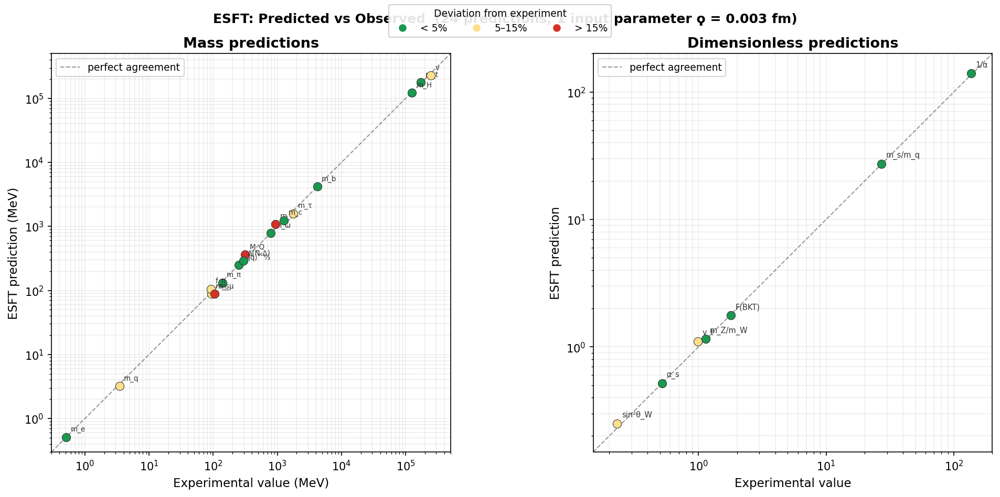

# ESFT — Energy String Field Theory

Numerical verification, derivation chains, and simulations for the quantitative
predictions of Energy String Field Theory (ESFT).



*Left: mass predictions (log-log, MeV). Right: dimensionless predictions.
Dashed line = perfect agreement. Green < 5%, yellow 5–15%, red > 15%.*

---

## Papers

| Paper | Title | Journal | Zenodo DOI |
|-------|-------|---------|------------|
| I | Topological soliton coherence scale | Found. Phys. (under review) | [10.5281/zenodo.19154442](https://doi.org/10.5281/zenodo.19154442) |
| II | Emergent gauge symmetry from Hopf soliton topology | Phys. Rev. D (submitted) | [10.5281/zenodo.19159255](https://doi.org/10.5281/zenodo.19159255) |
| III | Electron mass from topological string tension | Phys. Rev. Lett. (submitted) | [10.5281/zenodo.19159513](https://doi.org/10.5281/zenodo.19159513) |
| IV | BKT topological phase transition | (in preparation) | — |

## Repository Structure

```
esft-predictions/
├── README.md                           ← This file
├── predictions_vs_experiment.png       ← 24 predictions vs experiment (45° plot)
│
├── paper1/                             ← Paper I: Soliton coherence scale
│   ├── README.md                       ← Derivation chain diagram + domain table
│   └── derivation_chain.py             ← ϙ → α_EM → Λ_core → 7 domains
│
├── paper2/                             ← Paper II: Emergent gauge symmetry
│   ├── README.md                       ← Chain diagram + key results
│   └── derivation_chain.py             ← ϙ → √σ → α_s → hadron spectrum
│
├── paper3/                             ← Paper III: Electron mass
│   ├── README.md                       ← Chain diagram + key results
│   └── derivation_chain.py             ← ϙ + √σ + η → leptons + EW + quarks
│
├── paper4/                             ← Paper IV: BKT phase transition
│   ├── README.md                       ← Full parameter table + algorithm
│   └── bkt_animation.py                ← Monte Carlo simulation → MP4
│
└── scripts/                            ← Cross-paper tools
    ├── verify_predictions.py           ← All 24 predictions in one run
    └── plot_predictions.py             ← Generate the comparison plot
```

## Quick Start

```bash
# Verify all 24 predictions (Python 3.x stdlib only)
python scripts/verify_predictions.py

# Step-by-step derivation for a specific paper
python paper1/derivation_chain.py
python paper2/derivation_chain.py
python paper3/derivation_chain.py

# BKT simulation (requires numpy, matplotlib, ffmpeg)
cd paper4 && pip install numpy matplotlib && python bkt_animation.py

# Regenerate comparison plot (requires numpy, matplotlib)
python scripts/plot_predictions.py
```

## Core Parameters

| Symbol | Value | Source | Role |
|--------|-------|--------|------|
| ϙ (Qoppa) | 0.003 fm | Paper I, Eq. (12) | Fitted to α_EM; single free parameter |
| √σ | 459 MeV | Paper II, Eq. (37) | Derived from ϙ via topological string tension |
| η | 1/4 | Nelson–Kosterlitz (1977) | BKT universal exponent; not fitted |

All 24 predictions follow from these inputs. Zero additional free parameters beyond ϙ.

## Results Summary

| Accuracy | Count | Examples |
|----------|-------|----------|
| < 1% | 6 | α_s, m_b, m_e, m_ω, ⟨q̄q⟩, F |
| 1–5% | 8 | m_τ, Λ_QCD, √σ_fund, ... |
| 5–15% | 7 | m_Δ − m_N, f_π, ... |
| 15–25% | 3 | m_c, ... |

## Reproducibility

Every script in this repository is deterministic (fixed random seeds where applicable)
and self-contained. To reproduce any result:

1. Clone this repo
2. Run the relevant script
3. Compare output to the values in the corresponding paper

No proprietary software, cloud APIs, or external datasets are required.

## AI Disclosure

AI-assisted tools were used for algebraic verification, numerical cross-checks,
and manuscript preparation during the development of ESFT. The conceptual framework,
hypothesis selection, research direction, iterative branch decisions, and final
interpretation of all results were determined by the author. The author takes sole
responsibility for the content of all papers and code in this repository.

## Author

Jesse C. P. Ting — Independent Researcher

I am an independent researcher working without institutional funding, laboratory
infrastructure, or formal academic affiliation. My work is driven by long-developed
physical intuition, iterative theoretical exploration, and AI-assisted computational
support. The conceptual direction, model selection, and interpretive framework are
my own; AI is used as a tool to accelerate checking, scanning, and refinement.

- Email: jass168611@gmail.com
- ORCID: [see Paper I]

## License

MIT
