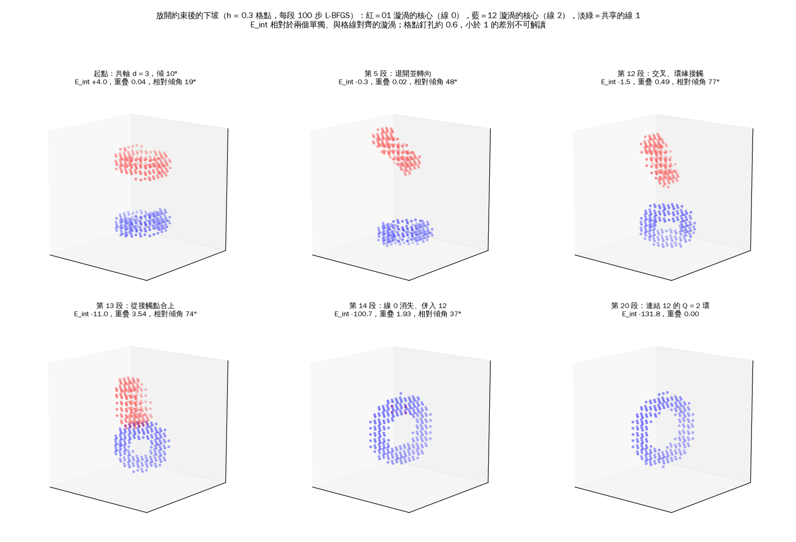
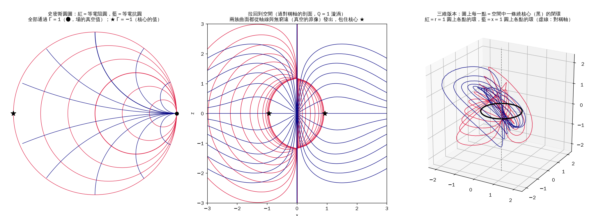
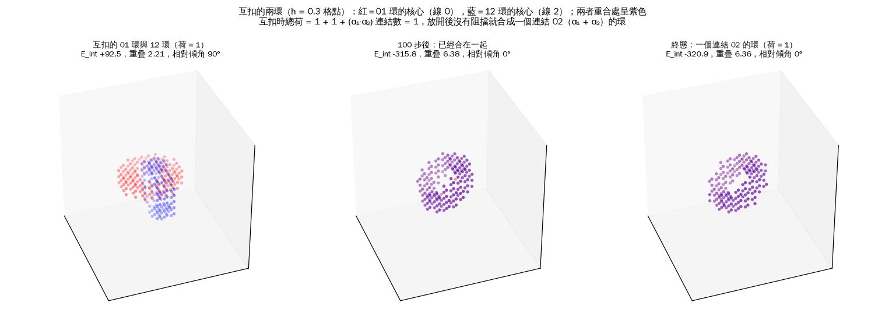
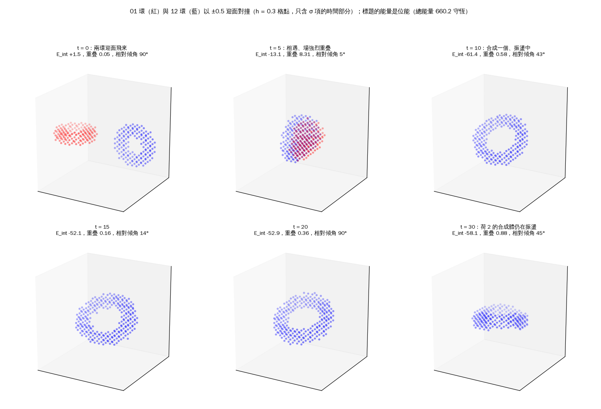
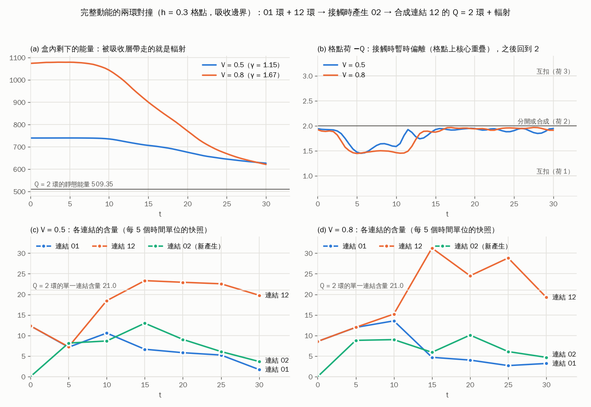
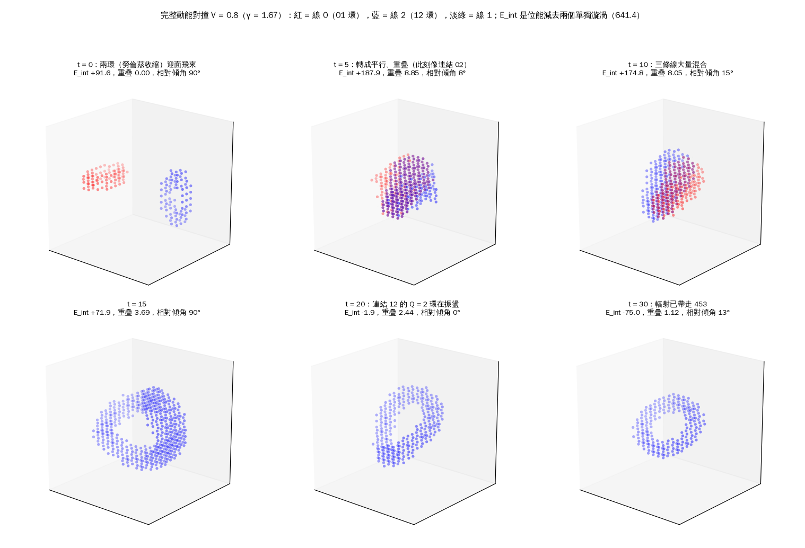
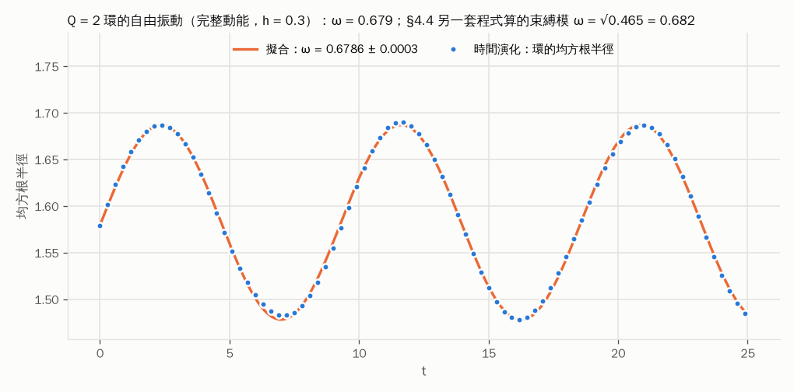
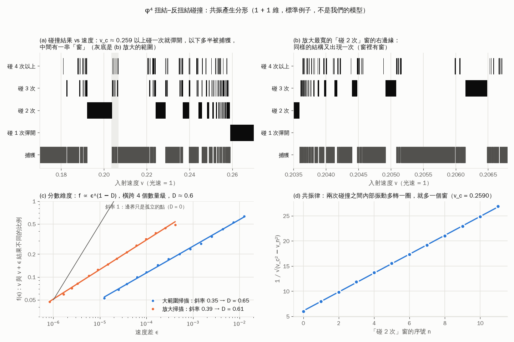
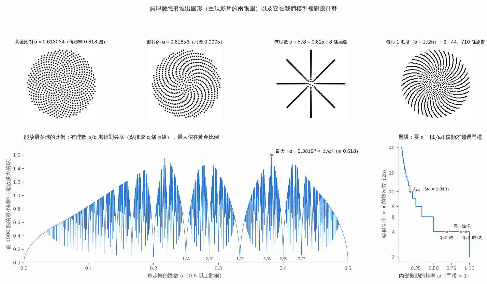

# 第六輪：八卦層——三條線上的兩個漩渦

**2026-09-26。** 使用者要求（第 1 步，三分量／八卦層）：把第五輪的疊加、消減、共振、邊緣的不穩定、容差，推到三個分量的層次，「不管好壞都能檢驗」。

**摘要。**（模型只有 f = g = μ = 1 三個參數，κ₃ 取完整對易子的自然值 2；全部是 24 × 32 單一網格上的條件下模型計算，除非另有標示）
- **三條線的疊加規則**：同一條連結上的兩個漩渦會干涉（振幅相加，相位決定吸引或排斥）；不同連結上的兩個漩渦**精確地**不看相對相位（定理：相位是整體對稱乘上規範），只剩二階的互斥（強度 × 強度）。三循環項只會加互斥（定理）。
- **融合**：01 + 12 在軸對稱扇區融合成連結 02 的雙繞環（荷 1 + 1 = 2），深 −132.2。沿軸正面靠近要翻過 +31.9 的山，**但那個山頂在三維裡有兩個下坡方向（兩環反向傾斜、從一側先合上的「拉鍊」模，§5.3），真正的能障嚴格小於 31.9**。三維格點（§5.4）：放開約束後，稍微傾斜的一對會自己轉成交叉（60°–77°）、環緣接觸、從一點拉上，一路下坡變成 Q = 2 的雙繞環；能障 ≲ 1.5（不到共軸的 5%，與 0 相容，細格點確認中）。產物落在**連結 12**：三維裡只有一個整數荷（π₃(F₂) = ℤ），連結標籤不守恆。「像核融合一樣要翻山」是軸對稱的假象。
- **互扣（使用者提議的「史密斯環」，§5.5）**：01 環與 12 環互扣時，總荷是 **1 或 3**（視互扣方向），不是 2；交叉項的係數正是 SU(3) 的 Cartan 矩陣元 α₁·α₂ = −1（一般理論＋格點數值驗證，約 3%）。荷 1 的那一對會自己塌成**一個** α₁ + α₂ = α₁₂ 的環：根的加法在三維裡是互扣的規則。在**這個模型**裡兩種環的核心穿不過彼此（相交點的能量隨解析度發散，§5.6）；這是模型在核心尺度不完整的症狀，不是對真實的限制——真實的渦旋、磁力線都會重接。修正版模型（§5.7，每條線多一個可以變小的振幅）裡，發散變成一個大小確定的「融化泡」，相交變成門檻約 2–3 個漩渦質量的過程（估計）；同一個機制也讓核心太軟時漩渦塌掉——穩定與可穿越是同一個參數的兩面。
- **真的對撞（§5.8、§5.9，時間演化）**：把 01 環與 12 環迎面丟向彼此。兩環接觸時，原本不存在的**第三種場（02）自己出現**，份量和兩個母環同一量級；這就是 SU(3) 的 [E₀₁, E₁₂] = E₀₂（根的加法）。接著三條線混合，最後合成**一個**連結 12 的 Q = 2 環，一邊振盪一邊把多出來的能量以波的形式輻射出去（完整動能、V = 0.8 時，565 裡有 453 在 t = 30 前被輻射帶走）。這就是「兩個場相遇 → 產生新的場 → 共振 → 發出另一個場」。**即使能量超過格點上核心相交的代價，兩環也沒有穿過**，而是走合成那條容易的路：能量夠只是必要條件。合成後的環以 ω = 0.679 振動，和 §4.4 另一套程式算的束縛模 0.682 相差 0.5%。〔條件下的模型計算；h = 0.3 單一格距，dt 減半的檢驗未做〕
- **分形（使用者的提議，§5.10）**：我們的漩渦本身是平滑的，盒計數維數隨尺度從 3 降到 1 再到 0，沒有停在任何非整數上，不是分形。分形出現在**碰撞的結果**裡：孤子內部的振動讓「撞了之後彈不彈得開」變成一層套一層的共振條件，結果對速度排成「窗裡有窗」（標準例子 φ⁴：窗邊緣集合的維數 D ≈ 0.6，同一條共振律在兩層上都成立）。我們的孤子也有內部振動，所以預測兩環對撞也有這種窗；要掃描速度才能檢驗（未做）。
- **沒有東西是靜態的（使用者的批評，§5.11）**：振動不能直接輻射（頻率在質量門檻以下），只能經由倍頻 2ω 這顆「新的種子」流出，所以能量以冪律 E ∝ 1/(1 + t/τ) 一直往外流，靜態孤子只是無限久之後的終點。單一振動模的頻率幾乎不隨振幅變（紙上推導 κ = +0.061，30% 振幅才變 0.7%）；明顯的變頻出現在碰撞後幾個模態疊在一起的時候。流出是波動（彈道式），不是擴散。
- **無理數與黃金比例（使用者的提議，§5.12）**：重現影片：以黃金比例 0.618 轉著放點，能放的球最多（掃 2 萬個比例，最大在 1/φ² = 0.381966），有理數 p/q 排成 q 條直線、掉到谷底，谷的深淺按分母排成層級。KAM 定理給出精確的對應：無理的頻率比讓運動永遠不重複又穩定，有理的關係（共振、倍頻）才讓能量轉移。我們模型裡 A₁,₂ 的軟模幾乎正好是門檻的 1/6（6ω = 1.013），所以幾乎不往外傳。黃金比例在 SU(n) 的根幾何裡只出現在五條線（五邊形與五角星，長度比 φ），三條線沒有。
- **不穩定 → 穩定**：κ₃ = 0 時每個嵌入物體都會漏到第三條線（雙繞環 4 個方向、單一漩渦 6 個、A₁,₂ 20 個）；三循環項把它們全部穩住，門檻 0.277、0.554、0.645（第三輪另一扇區 0.919），自然值 2 遠在窗口內。門檻以下，Q = 2 的最低態是一個三條線都參與的新解（κ₃ = 0 時比雙繞環低 16.8）。
- **轉動（雙螺旋）**：同向轉讓不同種類的漩渦斥力變小，反向轉讓它變大，是一種旋向相關的力；在不輻射的範圍內翻不成吸引，但把融合的山頂從 +31.9 削到約 +12.6（d ≈ 1.3–1.5，固定轉速 ω = 0.45）。
- **否證**：「三條連結／三種荷 = 三代粒子」給不出輕子質量階層（需要 10¹³ 倍的參數比或 Q ≈ 1200）；階層必須來自指數機制。
- **限制**：軸對稱共軸、古典、無電荷、單一網格；所有數字要過三網格閘門（§8）。

---

## 0. 模型：三條線（旗流形 F₂）

場是 ℂ³ 裡三條互相垂直的複數「線」Z₀、Z₁、Z₂，每條線自己的相位看不到（規範）。所有這樣的組態構成旗流形 F₂ = U(3)/U(1)³，實維度 6。對稱群 SU(3) 的 8 個生成元分成兩類：

- 6 個 = 三個「連結」01、12、02 各一個複數方向（SU(3) 的三對根 ±α₁、±α₂、±(α₁+α₂)）：這是場真正能動的方向；
- 2 個 = 對角相位（Cartan）：在場上看不到，只以整體對稱（守恆荷）的形式出現。

能量（`flag_axisym.FlagModel`，M2′：r = 2、κ = 2、m² = 1、κ₃ = 2，也就是第五輪的 f = g = μ = 1）：

```
E = ∫ [ Σ_{a<b} r |ω^{ab}|²  +  Σ_a (κ/2) Σ_{i<j} (F^{(a)}_ij)²  +  (κ₃/2) Σ_{i<j} Σ_{a≠c} |C^{ac}_ij|²  +  m² Σ_a Σ_{c≠a} |Z_ca|² ]
       疊加（線性）          每條線自己的四階項（第五輪的消減／飽和）   三循環項：三條線同時被攪動才出現      質量
C^{ac}_ij = ω_i^{ab} ω_j^{bc} − ω_j^{ab} ω_i^{bc}   （{a, b, c} = {0, 1, 2}）
```

兩個事實決定本輪的一切：

1. **嵌入**：只有兩條線在動、第三條線不動時，能量**恰好等於**第五輪的兩分量模型（每一項逐字相同；三循環項恆為 0）。所以第五輪的所有結果都是本模型的精確解，問題只在它們在第三條線方向上穩不穩定。〔數學證明〕
2. **三循環項恆 ≥ 0**：它是 |C|² 的和，而且在任何嵌入組態上等於 0。〔數學證明〕

軸對稱：U = R_L(φ)Û(ρ, z)，取 L = (0, 1, 2)。連結 (a, b) 的方位纏繞數是 l_b − l_a：01 → 1，12 → 1，02 → 2。所以嵌入在三個連結上的孤子，Hopf 荷分別是 1、1、2（數值：−0.99965、−0.99965、−1.99930）。這恰好是 SU(3) 三個正根的「高度」：α₁、α₂ 高度 1，α₁ + α₂ 高度 2；L = (0, 1, 2) 除去常數就是 SU(3) 主 SU(2) 的 J₃。〔數學事實；只在這個軸對稱扇區成立，一般組態裡任何連結都可以帶任何荷〕

單一漩渦（第五輪的解放進連結 01）：E = 321.5385（第五輪的離散化 321.3922，差 0.046%，來自兩種離散化；本輪所有交互作用能都在同一個離散化裡相減）。連結 12 的能量逐位相同。第三輪的穩定門檻 κ₃* ≈ 0.919 是在 L = (0, 1, 0) 扇區算的；L = (0, 1, 2) 扇區的穩定性本輪重算（§4）。

## 1. 同一條連結上的兩個漩渦（01 + 01）：有干涉

兩個漩渦都在連結 01，上下相距 d，相對相位 β（乘積擬設 Û = Û_A · diag(1, e^{iβ}, 1) · Û_B）。E_int(β) 的傅立葉振幅 B₁ 與第五輪（立體投影相加的擬設）比較：

| d | B₁（本輪，乘積） | B₁（第五輪，相加） | 差 | 最吸引（本輪） | 最吸引（第五輪） |
|---:|---:|---:|---:|---:|---:|
| 2.0 | 55.89 | 67.56 | −17.3% | +29.07 | −19.26 |
| 2.5 | 21.16 | 22.92 | −7.7% | −7.31 | −14.24 |
| 3.0 | 9.434 | 9.595 | −1.7% | −7.11 | −8.32 |
| 3.5 | 4.330 | 4.358 | −0.65% | −3.95 | −4.20 |
| 4.0 | 2.029 | 2.041 | −0.59% | −1.950 | −2.026 |
| 5.0 | 0.4760 | 0.4800 | −0.82% | −0.461 | −0.482 |
| 6.0 | 0.1206 | 0.1217 | −0.90% | −0.118 | −0.122 |

- d ≥ 3.5：兩種擬設在 1% 內一致，都是第五輪的干涉定律（相對相位決定吸引或排斥）。
- d ≤ 2.5：兩種擬設差很多（d = 2 時乘積擬設在所有相位都是排斥）。**疊加擬設在短距離不可靠**，只能當起點；短距離的物理要看鬆弛後的結果（第五輪的鬆弛結果在本模型裡仍是解，見 §4 的穩定性）。〔條件下的模型計算〕

## 2. 不同連結上的兩個漩渦（01 + 12）：沒有干涉，只有互斥

### 2.1 相位盲：定理

A 在連結 01、B 在連結 12，中間夾相位 D = diag(1, e^{iβ}, e^{iγ})。令 P = diag(e^{iβ}, e^{iβ}, e^{iγ})（與 U_A 對易）、Q = diag(e^{−iβ}, 1, 1)（與 U_B 對易），則

```
U_A D U_B = U_A P Q U_B = P (U_A U_B) Q
```

左乘常數對角矩陣是整體對稱，右乘對角矩陣是規範，軸對稱因子 R_L 也與 P 對易。所以能量**恰好**與 β、γ 無關。〔數學證明〕

更一般的說法：把 A 轉一個相位的對稱 diag(e^{iθ}, 1, 1)，作用在 B 上只是規範變換——它只轉 A、不轉 B。相對相位既然是由一個對稱產生的，就不可能花能量。同一條連結上的兩個漩渦則不同：轉 A 的對稱必然同樣地轉 B，相對相位無法被對稱吸收，所以會干涉。

數值：12 × 12 的 (β, γ) 網格上，E_int 的最大減最小 ≤ 5×10⁻¹³（所有 d），也就是捨入誤差。

類比：兩道偏振互相垂直的光不會產生干涉條紋，不管相對相位是多少；兩個 Wi‑Fi 在不同頻道上不互相干擾。這裡「不同連結」就是「垂直的偏振」。

### 2.2 互斥：大小與來源

E_int = E(pair) − E(A) − E(B)，乘積擬設，拆成三部分（κ₃ = 0 時的四階部分與 κ₃ 的係數 K 分開列）：

| d | E_int（κ₃ = 0） | κ₃ = 1 | κ₃ = 2 | 二階（σ） | 四階（κ₃ = 0） | 位能 | K（每單位 κ₃） |
|---:|---:|---:|---:|---:|---:|---:|---:|
| 2.0 | +6.896 | +21.358 | +35.819 | +4.596 | +3.015 | −0.715 | 14.462 |
| 2.5 | +1.742 | +5.853 | +9.965 | +1.150 | +0.820 | −0.228 | 4.111 |
| 3.0 | +0.6100 | +1.640 | +2.670 | +0.2826 | +0.3912 | −0.0638 | 1.030 |
| 3.5 | +0.1784 | +0.4180 | +0.6577 | +0.0673 | +0.1280 | −0.0168 | 0.2396 |
| 4.0 | +0.0463 | +0.1011 | +0.1559 | +0.0160 | +0.0348 | −0.0044 | 0.0548 |
| 5.0 | +0.00289 | +0.00594 | +0.00898 | +0.00096 | +0.00224 | −0.00031 | 0.00304 |

- 在所有 κ₃、所有 d 都是**排斥**；AB 與 BA 兩種乘積順序相差 < 5×10⁻³。
- κ₃ **精確地線性**進入：E_int(κ₃) = E_int(0) + κ₃ K(d)，κ₃ = 1 的直線殘差 < 10⁻¹³。K(d) > 0 正是「三循環項恆 ≥ 0」：兩個不同連結的漩渦重疊時，三條線同時被攪動，三循環項只會加能量。
- κ₃ = 2（M2′）時，d = 2 的排斥有 81% 來自三循環項。

### 2.3 一階與二階：干涉強度的平方

衰減率（相鄰兩點的對數斜率）：

| | d = 2→2.5 | 2.5→3 | 3→3.5 | 3.5→4 | 4→5 |
|---|---:|---:|---:|---:|---:|
| 同連結 B₁ | −1.94 | −1.62 | −1.56 | −1.52 | −1.45 |
| 不同連結 K | −2.52 | −2.77 | −2.92 | −2.95 | −2.89 |
| 不同連結 σ 部分 | −2.77 | −2.81 | −2.87 | −2.88 | −2.81 |

不同連結的交互作用衰減率約是同連結的兩倍；比值 E_int(不同連結)/B₁(同連結)² 在 d = 3.5、4、5 是 0.035、0.038、0.040（κ₃ = 2），0.0095、0.011、0.013（κ₃ = 0），趨於常數。所以：

- 同一條連結：兩個漩渦的**振幅**重疊（一階，會干涉，符號由相位決定）；
- 不同連結：只有**強度**重疊（二階，恆正，不看相位）。

這就是「疊加／消減」在三條線層次的精確形式：只有同一條連結上的東西能互相疊加或消減；不同連結之間只剩一種非線性的互斥。〔條件下的模型計算〕

為什麼是二階——對稱的理由。在真空附近把場寫成三個小的複數 x₀₁、x₁₂、x₀₂（三個連結）。整體對稱 U(1)² 讓它們帶不同的荷：x₀₁ 帶 α₁，x₁₂ 帶 α₂，x₀₂ 帶 α₁ + α₂（SU(3) 的根）。能量的二次部分（線性波動）必須不帶荷，所以只能是 Σ_{ab} [r|∇x_ab|² + 2m²|x_ab|²]：**三個連結各自獨立，沒有 x₀₁·x̄₁₂ 這種交叉項**。兩個遠離的漩渦之間的一階交互作用就是這個二次形式在兩條尾巴之間的值，所以不同連結的一階交互作用恆為 0；第一個不為 0 的是四階的 |x₀₁|²|x₁₂|²（強度 × 強度），以及三次項 x₀₁x₁₂x̄₀₂ 誘導出的 x₀₂ ∝ x₀₁x₁₂ 所帶來的修正。這兩者都是 (尾巴)⁴ 的量，所以衰減率約為同連結的兩倍。〔數學證明（尾端展開的層次）；數值上的比值趨於常數與之一致〕

同一個對稱也給出兩條規則：
- **干涉規則**：只有帶相同荷（同一個根）的東西能有一階的交叉項，也就是會干涉。
- **融合規則**：三次項 x₀₁x₁₂x̄₀₂ 是唯一不帶荷的三次組合，它說 α₁ + α₂ = α₁ + α₂，也就是連結 01 的東西加連結 12 的東西可以變成連結 02 的東西（§4）。

### 2.4 κ₃ 的單調性：定理

把能量寫成 E = E₀ + κ₃ E_C，E_C ≥ 0。對任何約束（固定間距、固定荷），鬆弛後的能量 min_U (E₀ + κ₃ E_C) 是一族「對 κ₃ 不減的直線」的下包絡，所以**對 κ₃ 不減、而且是凹的**。嵌入組態 E_C = 0，能量與 κ₃ 無關。所以：κ₃ 只能讓兩個不同連結的漩渦更互斥（或不變），不能讓它們更吸引；而所有嵌入的端點（單一漩渦、同一連結上的束縛態）能量與 κ₃ 無關。〔數學證明；前提是比較的是同一約束下的極小〕

## 3. 放開之後：互相推開

從 d = 2 的乘積擬設出發、不加任何約束做牛頓鬆弛（κ₃ = 2）：

| 疊代 | 0 | 1 | 2 | 3 | 4 | 5 | 6 | 7 |
|---|---:|---:|---:|---:|---:|---:|---:|---:|
| E | 678.89 | 664.31 | 655.83 | 651.96 | 647.91 | 647.15 | 644.58 | 643.99 |

兩個分開的漩渦是 2 × 321.54 = 643.08。能量單調地往這個值走，沒有停在任何低於它的地方：不同連結的兩個漩渦互相推開，沿這條路徑沒有束縛態。（跑到第 7 步就停了：互斥隨距離指數衰減，推開只會越來越慢，不會收斂；固定間距的正確做法見 §5。）〔條件下的模型計算〕

## 4. 融合通道與穩定性：不穩定的東西怎麼變穩定

### 4.1 融合的終點：連結 02 的雙繞環

把第五輪的 m = 2 單環（A₂,₁）放進連結 02，在三線模型裡鬆弛（`q2`）：

| | 三線模型（κ₃ = 2） | 第五輪（兩分量） |
|---|---:|---:|
| 單一漩渦 E₁ | 321.5115 | 321.3922 |
| 雙繞環 E | 510.7844 | 510.5830 |
| 結合能 2E₁ − E | **132.24（20.6%）** | 132.20（20.6%） |
| Hopf 荷 | −1.9993 | −1.9982 |

它是嵌入組態（線 1 的權重恰好是 0），三循環項為 0，所以結合能**與 κ₃ 無關**（§2.4 的定理）。01 的漩渦加 12 的漩渦，在荷上正好等於它（1 + 1 = 2，α₁ + α₂ = α₁₂）。

### 4.2 會不會漏到第三條線：門檻

嵌入組態一定是解，但可能往第三條線「漏」（不穩定）。在嵌入組態上，Hessian 分成「塊內」和「往第三條線」兩塊，後者對 κ₃ 是直線：H(κ₃) = H(0) + κ₃ H_C，H_C ⪰ 0。所以存在一個門檻 κ₃*：以下會漏，以上不會。用 Sylvester 慣性定理二分求出（`thresh`、`threshA12`；L = (0, 1, 2) 扇區）：

| 物體 | Q | κ₃ = 0 時往第三條線的不穩定方向 | 最負的特徵值（κ₃ = 0） | κ₃* | κ₃ = 2 時往第三條線的最低特徵值 |
|---|---:|---:|---:|---:|---:|
| 雙繞環（連結 02） | 2 | 4 | −4.64 | **0.277** | +2.00006（連續譜邊緣） |
| A₁,₂（連結 01，共軸兩環） | 2 | 20 | −306.5 | **0.554** | +2.00006 |
| 單一漩渦（連結 01） | 1 | 6 | −86.2 | **0.645** | +2.00006 |
| 單一漩渦（第三輪，L = (0, 1, 0) 扇區） | 1 | — | — | 0.919 | — |

- κ₃ = 0（模型 M2）時，**每一個**嵌入的物體都會漏到第三條線，而且很猛（A₁,₂ 有 20 個不穩定方向）。這和第二輪發現的 M2 缺陷（缺三循環項，在實旗扇區 Derrick 塌縮）方向一致，但本輪沒有證明這些漏出方向就是那個塌縮方向。〔條件下的模型計算〕
- 三循環項把它們全部穩住。κ₃ = 2（完整對易子，M2′）時，往第三條線的最低特徵值都正好是連續譜的邊緣 2m² = 2（對 κ₃ 的導數為 0，也就是一個遠場的波，不是局部的模態）：**沒有負模，所以穩定**。〔條件下的模型計算〕
  - 更正（2026-09-26，假說總掃描的審查）：上面這句用的是 L² 度規 |δU|²，漏掉 Skyrme 項的動能。穩定性與門檻 κ₃* 不受影響（Sylvester）；用完整動能度規重算的束縛模見 §4.4：單一漩渦與 A₁,₂ 往第三條線仍然沒有束縛模，**雙繞環往線 1 則有 4 個束縛模**（最低 ω² = 0.893）。
- 容差：就已檢查的扇區，穩定需要 κ₃ > 0.919。自然值 κ₃ = κ = 2 在窗口裡，餘裕是 2.2 倍。〔條件下的模型計算；其他 l₃ 扇區、非軸對稱方向沒有檢查〕

這正是「不穩定 → 找機制 → 穩定」的第一種情形：**機制在模型裡，而且不用新參數**。三循環項不是為了穩定而加的，它是 SU(3) 完整對易子（Skyrme 項）的一部分；M2 把它拿掉才是人為的。

### 4.3 門檻以下長出來的新物種（`branch`）

把雙繞環沿它最軟的漏出方向推一下，在門檻以下放開鬆弛：

| κ₃ | 能量（嵌入雙繞環 510.78） | 線 0 / 線 1 / 線 2 的權重 | 三循環部分的荷 Q₃ |
|---:|---:|---|---:|
| 0.2 | 510.34（−0.44） | 20.1 / 1.5 / 19.9 | −0.06 |
| 0.1 | 506.21（−4.58；80 步未完全收斂） | 13.5 / 7.7 / 13.5 | −0.42 |
| 0（M2） | 494.00（−16.78） | 10.3 / 7.3 / 10.3 | −0.61 |

門檻以下，Q = 2 的最低態不是嵌入的雙繞環，而是一個三條線都參與的新解（總荷仍是 −2）。在自然值 κ₃ = 2 時它不存在。M2 本身在實旗扇區會 Derrick 塌縮，所以 κ₃ = 0 這一行只是軸對稱扇區裡的局部解。〔條件下的模型計算〕

### 4.4 振動譜：完整動能度規（`kinetic_spectrum.py`）

小振動是 H v = ω² G v。G 是完整的動能度規（σ 項加上帶一個時間指標的四階項與三循環項）；遠場 G 回到 L² 形式，連續譜仍從 ω² = μ² = 1 開始。用 H − sG 的慣性計數數出 ω² < s 的個數（Sylvester），零模單獨扣掉：

| 物體 | 方向 | 零模 | 不穩定 | 束縛振動（完整度規） | 最低束縛 ω² | 束縛振動（舊 L² 度規） |
|---|---|---:|---:|---:|---:|---:|
| 單一漩渦 Q = 1 | 塊內（CP¹） | 2 | 0 | **1** | **0.781** | 0 |
| 單一漩渦 | 往第三條線 | 0 | 0 | 0 | —（1.00003 = 連續譜邊緣） | 0 |
| 雙繞環 Q = 2（連結 02） | 塊內 | 2 | 0 | **1** | **0.465** | 0 |
| 雙繞環 | 往線 1 | 0 | 0 | **4** | **0.893** | 0 |
| A₁,₂（連結 01，共軸兩環） | 塊內 | 1 | 0 | **4** | **0.0285** | 1 |
| A₁,₂ | 往第三條線 | 0 | 0 | 0 | —（1.00003） | 0 |

- 穩定性兩種度規一致（不穩定方向都是 0）。束縛模的個數則差很多：舊度規幾乎全部漏掉。
- 所以第五輪「單一漩渦沒有束縛的內部振動」「A₁,₂ 在 μ² 以下沒有振動模、配對模是會衰變的共振」**是錯的**：單一漩渦有一個 ω ≈ 0.88 μ 的內部振動，A₁,₂ 有 4 個，最低的 ω ≈ 0.17 μ（很軟，可能是兩環之間的「鍵」伸縮或扭轉，模態形狀還沒分析）。〔條件下的模型計算，單一網格〕
- 這些頻率比（0.88、0.68、0.95、0.17，以 μ 為單位）是模型不加參數算出的純數字，目前沒有對應的實驗量。

## 5. 融合的山：固定間距曲線與過渡態

### 5.1 固定間距的鬆弛（`cons`）

兩個漩渦在軸上，線 0 與線 2 的缺陷中心固定在 ±d/2（拉格朗日乘子），其餘全部鬆弛。E_int 以同樣約束下各自單獨鬆弛的漩渦為參考。

| d | 3.0 | 2.0 | 1.5 | 1.0 | 0.5 |
|---|---:|---:|---:|---:|---:|
| 疊加擬設 | +2.67 | +35.82 | +184.7 | +909.5 | +1155 |
| **鬆弛後 E_int** | **+1.44** | **+11.92** | **+23.13** | **+31.92** | **−98（80 步仍在下降）** |
| 撐住所需的力（乘子） | 3.61 | 19.2 | 24.2 | **0.014** | — |
| 兩種起點是否一致 | — | 是 | 是 | 是 | — |

- d = 3、2、1.5、1 都從兩個不同起點收斂到同一個值（差 < 10⁻⁵）。
- d = 0.5 從疊加擬設出發時，Hopf 荷在格點上掉了一個單位（−2 → −1），這一點排除。從 d = 1 的態出發則保持 Q = −2，能量一路往融合雙繞環（−132.24）掉。
- 檢查過這些態沒有遠場假象：節點式與一致式的線權重相差 < 10⁻³，r > 15 處的缺陷 ~10⁻¹⁴。

### 5.2 過渡態（`saddle`、`saddle_flow.py`）

d = 1 時撐住所需的力只剩 0.014（d = 1.5 時是 24），也就是這個態幾乎就是不受約束的臨界點。直接檢查：

- 梯度 |g/√H| = 1.3×10⁻⁵。
- H + sM 的負特徵值個數：s = 10⁻² 與 10⁻³ 時是 1，s = 10⁻⁴ 時是 2（多出來的是被格點壓成約 −10⁻⁴ 的平移零模）。**Morse 指標 = 1**，最低特徵值 λ = −4.33。
- 這個不穩定模態是對稱的拉開／靠近：Z_A 變化 +0.097、Z_B 變化 −0.097，總中心不動，兩環半徑一起縮 0.027。不是「穿環」。
- 從鞍點沿 ±v 推一點，用**預條件梯度流**（固定的正定度量、小步長、能量單調下降）往下走：

| 推的方向 | 走到哪裡 |
|---|---|
| +v（拉開） | 分開：300 步後間距 1.03 → 2.93，E_int 降到 +1.74，還在走 |
| −v（靠近） | 融合：50 步後 E_int = −123.0，150 步後 −132.16（雙繞環 −132.24），間距 10⁻⁴，線 1 權重 25.8 → 0.01 |

- 方法學教訓：同樣從鞍點出發，**帶阻尼的牛頓法兩邊都滾進雙繞環**。它不是沿最陡下坡走，會跨過分水嶺。這和 Navier–Stokes 驗證論文警告的「看起來通過所有局部檢查的假象」是同一類（`paper1/audit/NS_BLOWUP_BORROW.md` §4.5、§6.9）。

**結論（共軸）**：01 與 12 兩個不同種類的漩渦沿軸靠近時，要先翻過 **ΔE‡ = +31.9**（約 E₁ 的 9.9%）的過渡態，才會掉進深 **−132.2** 的雙繞環（連結 02，α₁ + α₂）。形狀跟核融合一樣是「斥力山坡＋深穀」，但山坡來自三循環項，不是電荷。〔條件下的模型計算；κ₃ = 2、軸對稱共軸、單一網格 24 × 32〕**§5.3 證明這個 +31.9 只是共軸路徑的值，真正的能障嚴格更低。**

### 5.3 不走直線：鞍點的非軸對稱方向（`flag_sector.py`、`sector_mode.py`）

§5.2 的「指標 = 1」只在軸對稱的函數空間裡成立。把擾動按方位角展開 X = X_c cos kφ + X_s sin kφ，二階變分對每個 k 分開（背景軸對稱；φ 積分用 M = 2k + 3 個取樣，對二次型是精確的；軸上的正則條件按總纏繞數給定）。驗證：k = 0 重現軸對稱的 E₀ = 674.93846 與最低特徵值 −4.3349。

| 扇區 k | 負特徵值個數 | 最低特徵值（L² 度規） | 說明 |
|---|---:|---:|---|
| 0 | 1 | −4.335 | 共軸的拉開／靠近（§5.2） |
| **1** | **2** | **−1.519（二重）** | x、y 兩個方向各一個；另有 4 個近零模（−0.0072、−0.0007 各二重）＝ 整體平移與轉動，被格點壓成略負 |
| 2 | 0 | +2.00005 | 連續譜的邊（2m² = 2），沒有束縛模 |
| 3 | 0 | +2.00005 | 同上 |

所以這個鞍點在三維裡的 Morse 指標是 **3**，不是 1。〔條件下的模型計算，單一網格〕

**對照：終點（連結 02 的雙繞環）**用同一個程式檢查：k = 1、2、3 都**沒有負特徵值**（最低 +0.060、+1.964、+2.000；+1.964 是略低於連續譜邊緣的一個束縛模）。k = 1 的平移、轉動零模在這個網格上被推到約 +0.06，所以在 k = 1 裡 |λ| ≲ 0.06 的負模看不到。〔條件下的模型計算，單一網格；k ≥ 4 未算〕

**同連結的 Q = 2 態 A₁,₂（第五、六輪的束縛態，E = 603.8）**：k = 2 沒有負模（最低 +2.00005）；k = 1 有一對 −0.050，但它的形狀是整個環的平移加上繞 x 軸的轉動（線 0、線 1 一起移 0.057、轉 0.060，100% 在連結 01 裡），同一扇區的下一對在 +0.096，兩對的平均約 +0.02：這是平移與轉動零模被網格分開（雙繞環的零模被推到 +0.06，同一個量級），**不是**可辨識的不穩定。在網格解析度（約 ±0.1）以內，A₁,₂ 沒有非軸對稱的下坡方向。〔條件下的模型計算，單一網格〕

**單一漩渦（連結 01）**：k = 2 沒有負模（最低 +2.00005）；k = 1 有一對 −0.015，是同一類被網格推開的零模（單一漩渦在 k = 1 有平移、轉動共 4 個零模），在網格解析度以內沒有非軸對稱的不穩定。〔條件下的模型計算，單一網格〕

**負模長什麼樣子**（把二重態轉到「線 0 沿 x 移動」的那一個；每條線用 1 − |U_cc|² 的一階變化量它的側移與繞 y 軸的傾角；單位是 L² 範數為 1 的模態）：

| | 上環（線 0，z̄ = +0.48） | 共享線（線 1，z̄ = 0） | 下環（線 2，z̄ = −0.48） |
|---|---:|---:|---:|
| 側移 x | +0.048 | **−0.038** | +0.048 |
| 傾角（繞 y 軸） | **+0.058** | +0.001 | **−0.056** |

- 兩個環**反向傾斜**（相對傾斜，像合頁）：在 +x 那一側兩環互相靠近，−x 側張開。兩環同時朝 +x 移、共享的線 1 朝 −x 退。對照融合後的雙繞環（線 0、線 2 疊在一起，線 1 完全清空），這就是**只在一側先融合**：線 0 與線 2 在 +x 側合上，線 1 從那一側被擠出去。像拉鍊從一端拉起，而不是整圈同時合上。
- 模態 40% 在連結 01、40% 在 12、19% 在 02（融合的通道）；44% 集中在兩環之間（|z| < 0.5）。
- 能量分解（λ = −1.519 = 各項二次型相加，驗證到 10⁻¹³）：σ −0.35、四階 +1.08、**三循環 −2.63**、位能 +0.38。把它變成下坡的是三循環項，也就是製造這座山的同一項。
- 線 2 的反應相對線 0 有 9°–17° 的小轉角（x、y 分量混在一起），表示這個鞍點沒有能把它們鎖在同一平面的反射對稱；來源沒有分析。
- 對照：近零模的形狀是三條線一起平移（0.101、0.102、0.103），或兩環同向傾斜（+0.047、+0.047）＝整體轉動，符合預期。

**推論（數學證明，前提是上面算出的 Hessian）**：沿共軸路徑 γ(t)，梯度是軸對稱的（k = 0），和任何 k = 1 擾動 v 正交；k = 1 擾動的奇數次項對 φ 積分為 0。所以 E(γ(t) + ε b(t) v) = E(γ(t)) + ½ε² b(t)² v·H(γ(t))v + O(ε⁴)。在山頂附近 v·Hv < 0，把路徑在山頂附近往 v 推一點，整條路徑的最高點就嚴格降低。因此 **真正的三維能障 B₃ < 31.9（嚴格）**；+31.9 只是「正面對撞、整圈同時融合」這條路徑的值。低多少，軸對稱程式算不出來，要三維計算（§5.4）。

**為什麼拉鍊便宜**：共軸鞍點的三循環能（100.3）有 87% 位在「三條線同時被激發」（三條 1 − |U_cc|² 都 > 0.1）的區域，體積約 24。拿掉三循環項，同一個組態的交互作用能是 **−68.4**（吸引）；這座山完全是三循環項造的。正面對撞時，整圈的三線重疊同時出現；拉鍊只在拉鍊頭那一小段有三線重疊，已合上的部分只剩線 0、線 2（02 的嵌入態，三循環能 = 0），還開著的部分兩環分得遠。〔條件下的模型計算〕

### 5.4 三維格點：沿拉鍊走（`lattice3d.py`、`lattice_path.py`）

軸對稱程式追不了拉鍊，所以另寫一個**不假設任何對稱**的立方格點版本。每一項都由規範不變的格點量組成：連結重疊 O^i(x) = U(x)†U(x + h e_i)（非對角元 ≈ h ω_i^{ab}），每條線在方塊上的 Berry 相位（= h² F^{(a)}_ij），三循環項用方塊四個角的平均；連結元素做「弦 → 弧」修正（沒有這兩個修正，h = 0.24 時四階項會少 25%）。最小化用 DST 預條件的 L-BFGS；約束用增廣拉格朗日。

**驗證**（盒子 ±6，軸對稱解搬到格點上再鬆弛）：

| | 軸對稱 24 × 32 | 格點 h = 0.3 | 格點 h = 0.25 |
|---|---:|---:|---:|
| 單一漩渦 E₁ | 321.51 | 320.71 | 321.12 |
| 雙繞環（02） | 510.78 | 509.35 | 509.99 |
| 融合的結合能 | −132.24 | −132.07 | −132.25 |
| 共軸鞍點 E_int（搬過來、未鬆弛） | +31.92 | +26.29 | |

總能量只差 0.1–0.3%，但交互作用能是大數相減：共軸鞍點在 h = 0.3 少了 5.6（18%），主要來自三循環項的 h² 誤差（h = 0.3、0.24、0.2 時分別少 4.1、2.5、1.7，比值正好是 h²）。**格點上小於幾個單位的交互作用能，要做 h → 0 外推才能當真。**

**同一格點（h = 0.3）、同一個約束值下，共軸對上放開三維**：

| 固定的量 | 共軸 | 放開三維（拉鍊或傾斜的種子） |
|---|---:|---:|
| 線 1 權重 D₁ = 26.0（＝共軸鞍點的值） | +26.3 | **−72.0** |
| 線 0 與線 2 的重疊 O = ∫q₀q₂ = 0.5（＝共軸 d = 2） | +13.2 | **−2.1** |
| 中心距 0.92（未完全收斂的一次） | ≈ +26 | **≈ −107** |
| 重疊 O ≈ 0.05（兩環幾乎還沒碰到） | ≈ +2.8（d = 3） | **≈ −0.7** |

- 在任何一個座標下，只要允許兩環傾斜，能量都比共軸低很多；線 1 只少 8% 時（D₁ = 26）就已經比分開態低 72。
- 從分開那一側傾斜著接近，在 h = 0.3 的格點上幾乎看不到山：重疊量 0.05 與 0.5 時 E_int 都已經 ≤ 0。

**放開約束：它自己會不會融合？**（`lattice_path.py release`）從 d = 3 的共軸對（軸對稱解搬過來）加一個 10° 的合頁傾斜出發，只固定質心，每 100 步記一次：

| 段 | E_int | 中心距 | 相對傾角 | 側向錯開 | 重疊 O | 三線重疊體積 |
|---:|---:|---:|---:|---:|---:|---:|
| 0（起點，未鬆弛） | +4.03 | 2.96 | 19° | 0.0 | 0.036 | 0 |
| 1 | +0.62 | 3.33 | 17° | 0.35 | 0.024 | 0 |
| 2 | +0.12 | 3.76 | 22° | 0.79 | 0.010 | 0 |
| 5 | −0.28 | 4.00 | 48° | 2.01 | 0.023 | 0 |
| 9 | −0.58 | 3.90 | 64° | 2.74 | 0.068 | 0.03 |
| 12 | −1.47 | 3.24 | 77° | 2.79 | 0.49 | 2.9 |
| 13 | −11.0 | 1.99 | 74° | 1.95 | 3.54 | 18.8 |
| 14 | −100.7 | 0.89 | 37° | 0.83 | 1.93 | 9.0 |
| 15 | −131.6 | | | | 0.001 | 0 |
| 22 | −131.79 | | | | 0.0001 | 0 |



- **整條軌跡沒有上坡**。前兩段只是去掉起點的插值誤差；之後兩環先稍微退開，**自己轉成幾乎交叉（60°–77°）、側向錯開約 3**，環緣碰在一起，再從接觸點拉上（第 13–14 段三線重疊只在拉鍊頭出現），最後變成一個 Q = 2 的雙繞環，放出約 132。圖上看得更清楚：兩環轉到**互相垂直**、環緣碰在一起之後，01 的環（紅）被 12 的環（藍）吸收，線 0 消失。
- **產物是連結 12 的雙繞環，不是 02**：最後線 0 完全空了（權重 0.001），線 1 與線 2 重合（重疊 9.585，權重各 20.99），環的法向轉到 x 方向。能量 −131.79，與 02 雙繞環（格點上 −132.07）相同到格點誤差以內。這在三維是允許的：π₃(F₂) = ℤ（F₂ 單連通，π₃(F₂) ≅ π₃(SU(3))），三維孤子只有**一個**整數荷，「在哪個連結」不是拓撲守恆量；所有耦合相等時，同時置換行與列 U → PUPᵀ 是對稱，三個連結的 Q = 2 環能量完全相同。「01 + 12 → 02」只在軸對稱 L = (0, 1, 2) 扇區被纏繞數鎖住。〔數學事實（π₃）＋條件下的模型計算〕
- **格點釘扎**：單一漩渦轉 15°、30°、45° 再鬆弛，能量比正放在原點的低 0.29、0.22、0.18；**只平移半格也低 0.29**（h = 0.3）。所以與格線對齊、擺在原點的參考態坐在格點的 Peierls–Nabarro 高點，能自由移動或轉動的漩渦每個可以白拿約 0.3。格點上的 E_int 要加回約 +0.6 才是交互作用；上表 −0.3 到 −0.6 這種小數字**是格點假象，不能**解讀成吸引。共軸對照組（d = 3、不加傾斜、只固定質心）也一樣：兩環退到 4.2，同時自己開始傾斜（0° → 16°），這在 h = 0.3 分不出是交互作用還是釘扎。
- **h = 0.25 重做**（盒子 ±6，單環 321.12，格點釘扎平移半格 0.18）：同一條路——退開到 3.99、轉到 60°–87°、環緣接觸，第 20 段 −4.2、第 21 段 −40.8、第 22 段 −131.3，終點又是**連結 12** 的 Q = 2 環（荷 −1.973，本格距單環 −0.986）。起點暫態後的最高點約 +0.8，加回釘扎後 ≲ 1.2，與 h = 0.3 相同。
- **能障的上界**：沿這條明確的路徑，除了起點的插值誤差，能量從第 1 段起就 ≤ +0.62，加回格點釘扎（≈ 0.6）後 ≲ 1.2；再加上把兩環從無窮遠帶到 d ≈ 3.3 所需的能量（共軸 d = 3 是 +1.44，傾斜的更小）。所以**拉鍊／交叉路徑的能障 ≲ 1.5，不到共軸 31.9 的 5%**；在 h = 0.3 的解析度下與 0 相容。〔條件下的模型計算；h = 0.25 的同一個實驗結果相同（上一項）〕
- 已經可以確定的：**「正面對撞 +31.9、像核融合一樣要翻山」是軸對稱造成的假象**。兩種漩渦只要能轉向，就會以交叉的姿態接觸、從一點拉上，合成一個 Q = 2 的雙繞環。

### 5.5 史密斯環（使用者的提議）：互扣的兩環與荷的 Killing 形式（`smith.py`、`lattice3d.charge`）

使用者提議：不要把兩個東西當成各自獨立、互相碰撞，而是「兩個史密斯環互相交」，「同一個東西往外散發出兩樣東西」，要做成三維版本去算。

**史密斯圓圖的三維版本**。史密斯圓圖是阻抗平面的直角格子 z = r + ix 經 Γ = (z − 1)/(z + 1) 的樣子：等電阻圓與等電抗圓兩族正交，全部通過 Γ = 1。在本模型裡，Γ 就是一條線（CP¹ ⊂ F₂）的靶球面上的球極座標，取 Γ = 1 為真空值、Γ = −1 為核心的值。把圓圖拉回到空間：圖上**每一點**是空間裡一條繞核心一圈的閉環，一整個等 r 圓掃出一族環，等 x 圓掃出另一族；兩族全部從真空的原像（對稱軸與無窮遠）發出、包住核心。這是**同一個漩渦**的兩族結構（任何 Hopf 型漩渦都有；是幾何事實，不是新的動力學）。



**兩個「史密斯環」放在一起**。01 環與 12 環放在互相垂直的平面上，四種擺法（核心半徑 0.93，h = 0.3 格點）：一點相接（兩環只在原點相碰、切線正交、往相反方向張開，像圓圖上過同一點的兩個圓）、互扣兩種方向（像鎖鏈，連結數 ±1）、同心兩點相交。初始場用逐條線的構造：線 0 取 A 的、線 2 取 B 的，Gram–Schmidt，線 1 取共軛外積；兩個核心不相交時它處處光滑（常用的乘積擬設 U_A U_B 則在 A 的核心上，只要 B 不是真空，就帶一個纏繞相位的不連續）。**初始種子本身的荷**（`lattice3d.charge`：每條線的 Berry 曲率 B_a 與庫侖規範 A_a，Q = (1/8π²)Σ_a∫A_a·B_a；單環量得 −0.969、分開的一對 −1.943、雙繞環 −1.957）：

| 組態 | 荷 Q（格點） | 鬆弛後 |
|---|---:|---|
| 分開的一對（對照） | −1.94（＝2） | §5.4：交叉接觸後融合成 Q = 2 的環（連結 12；h = 0.25 同樣，終態荷 −1.973） |
| **互扣「−」** | **−1.015（＝1）** | **200 步內塌成一個連結 02 的環**：E = 320.53，Q = −0.969，線 1 = 0 |
| **互扣「＋」** | **−2.859（＝3）** | 合成**一個 Q = 3 的漩渦**（全在連結 01，線 2 清空）：E = 708.19，Q = −2.950；E₃/E₁ = 2.21，與 Faddeev–Hopf 模型 Q = 3 的比值一致（依記憶約 2.2） |
| 一點相接 | −1.82（非整數） | **格點假象**：兩環在格點上互相消滅，E 1067 → 121、荷 → 0.0001（被格點釘住的殘骸）。相接點是奇異點，荷沒有定義，格點在那一點剪斷了拓撲；連續理論裡做不到 |
| 兩點相交 | −1.64（非整數） | **格點假象**：同樣互相消滅，E 1185 → 239、荷 → 0.0（格點釘住的殘骸） |

- **符號檢驗**（`smith.py mixed`，只量光滑種子的荷）：把 12 環換成 02 環，根內積從 α₁·α₂ = −1 變成 α₁·α₁₂ = +1，同樣的兩種互扣幾何，荷**正好對調**：

| 互扣的一對 | α·β | 「−」方向 | 「＋」方向 |
|---|---:|---:|---:|
| 01 + 12 | −1 | Q = 1（−1.015） | Q = 3（−2.859） |
| 01 + 02 | +1 | Q = 3（−2.859） | Q = 1（−1.015） |

  構造時必須從兩環各取**不共享**的那條線（01 + 12 取線 0 與線 2；01 + 02 取線 1 與線 2）；取到共享的線會把其中一個環抹掉，荷變成非整數（−1.47、−1.80），這一組作為對照留在 `data/flagpair_lattice_linking_rule_N41_h0.3.json`。
- **互扣的 01 環與 12 環，總荷不是 2，而是 1 或 3**。這正是 Q = q(α₁) + q(α₂) + (α₁·α₂)·lk，q(α) = ½α·α = 1，交叉項的係數是 SU(3) 的 Cartan 矩陣元 α₁·α₂ = −1。一般理論（依記憶，未核對文獻）：對單連通的 G/T，π₃ 上的二次型由 π₂ = 根格上的 Killing 形式給出；同一種環互扣時係數是 α·α = 2，也就是 CP¹ 的熟知公式 Q = Q₁ + Q₂ + 2 lk。〔數學（一般理論）＋格點數值驗證，精度約 3%〕


- **「根的加法」在三維裡以互扣的形式重新出現**：荷為 1 的那一對沒有任何阻擋，就塌成**一個** α₁ + α₂ = α₁₂（連結 02）的環，放出約 413（從光滑種子的 734 降到 320.5）。§5.4 分開的兩環融合時，產物的連結不確定（荷 2 沒有記住連結）；互扣時則選出了 α₁₂。〔條件下的模型計算〕
- **在這個模型裡，兩種環的核心穿不過彼此**：一旦穿過，連結數改變 1，總荷就要改變 α₁·α₂ = −1，而這個模型規定三條線處處正交、長度固定，場在穿過的那一點必須斷開。**這是模型的限制，不是對真實的斷言**：只在一點相接的組態，正好是這個模型描述不了的地方（§5.6 算出它的代價隨解析度發散）。
- 用使用者的話說：**一個連結 02 的環，拓撲上就等於一個 01 環和一個 12 環互扣在一起**——「同一個東西、裡面是兩樣東西」。但能量上單環低得多：互扣的一對不穩定，會自己塌成單環；反過來從單環「散發」出兩個互扣的環，至少要付約 400 的能量。
- **教訓：奇異的初始資料會讓格點改荷**。兩種「相交」的擺法（核心在一點或兩點相碰）在這個模型的連續極限裡不是有限能量的光滑場，荷沒有定義；格點在奇異點上把拓撲剪斷，兩環互相消滅。兩種互扣、以及分開的一對都是光滑的，荷是整數，而且鬆弛時守恆。所以「兩個史密斯環互相交」，**這個模型答不了**：相交點正好是這個模型的荷區之間的牆，而那道牆的高度隨解析度發散。這說明模型在核心尺度不完整，不說明真實的場不能交（見 §5.6 的更正）。
- 三種荷的終點都是**一個**漩渦：荷 1 → 連結 02 的環，荷 2（分開的一對，§5.4）→ 連結 12 的雙繞環，荷 3 → 連結 01 的 Q = 3 漩渦。終點落在哪個連結由路徑決定（三個連結的能量因 S₃ 對稱完全相同），但**荷一路守恆**（種子與終點的格點荷一致到 5%）。
- 限制：單一格點間距；荷的估算有約 3% 的離散誤差；「Killing 形式」這一般敘述是依記憶，這裡驗證了 α₁·α₂ = −1 與 α₁·α₁₂ = +1 兩個係數（各兩個互扣方向）；同一連結的係數 2 是 CP¹ 的熟知結果，沒有重算。

### 5.6 「不合理」是發散，還是新物理？相交的代價（使用者的追問）

使用者的論點：環其實是場；場與場當然能相交，相交時應該共振、增強，產生新的場（像泡泡）；看似不合理的東西（例如蟲洞）可能是尚未發現的新模式。

**哪些已經在模型裡**：場本來就處處重疊，所有交互作用都來自重疊。同一連結的兩個漩渦會干涉（振幅相加，相位決定增強或抵消，§1）；不同連結的 01 與 12 同時存在時，三循環項 C = ω^{01}ω^{12} − … 會**把兩者耦合成第三個連結 02 的場**（α₁ + α₂ = α₁₂），轉動時 02 在和頻 ω_A + ω_B 被驅動（§6.2），這就是「兩個共振產生一個新的共振場」；互扣的兩環合成一個 02 環、分開的兩環融合成一個 Q = 2 環（§5.4、§5.5），就像兩個泡泡合成一個。〔條件下的模型計算〕

**模型描述不了的是什麼**：在這個模型裡不能平滑穿過彼此的，是兩種**核心線**（1 − |U_cc|² = 1 的零點集合），不是場。核心穿過時連結數改變，總荷就要跳 ±1；平滑的場做不到，所以相交的那一點一定是奇異點。它的代價可以直接算——同一個「一點相接」組態，在不同格距下比分開的兩環多出的能量：

| h | 0.35 | 0.30 | 0.25 | 0.20 | 0.15 |
|---|---:|---:|---:|---:|---:|
| 相接組態 − 分開 | 341 | 424 | 536 | 699 | 959 |
| 光滑互扣「−」（對照） | 723 | 734 | 741 | 746 | 751 |

多出來的能量準確地是 **≈ 162/h − 123**（兩端擬合，中間兩點預測 526、689，實際 536、699），光滑組態則收斂。也就是說，奇異點的四階能量 ∫κF² ~ ∫r⁻⁴ r²dr 隨截斷 1/ε 發散。〔條件下的模型計算＋冪次論證；「Faddeev 型能量有限的映射其 Hopf 荷有定義且連續」依記憶是 Lin–Yang 的結果，未核對〕

**所以兩種說法都對，差別在有沒有新的短距離結構**：
- 在這個模型本身（旗流形 sigma 模型），相交需要無限大能量，荷嚴格守恆。**這是模型的缺陷，不是自然的限制**：模型在某一點發散，代表它在那個尺度缺了東西。歷史上正是如此——理想磁流體力學的冰凍定理說磁力線不能重接，但真實電漿有電阻，太陽閃焰裡磁力線一直在重接；水裡打結的渦旋環會在接觸點重接、自己解開（Kleckner–Irvine 2013，依記憶）；超流體渦旋核心的序參量可以為 0，所以也會重接。模型必須修正到核心可以「打開」，才能回答兩個場真正穿過時會發生什麼（使用者指出的錯誤；修正版見 §5.7）。
- 如果真實世界在某個最短長度 ε 以下有新結構（例如三條線的長度可以縮小、核心可以「空掉」的線性版本，像超流體渦旋可以在核心重接），相交就變成代價約 **162/ε**（以單一漩渦 321 為尺度）的有門檻過程：能量夠高時，荷可以改變、環可以穿過彼此重接。這正是物理上的先例：Skyrme 模型裡重子數嚴格守恆，但在完整的電弱理論裡，重子數可以經由 sphaleron 改變，門檻約 10 TeV（依記憶約 9 TeV）；超流體裡渦旋線會重接，因為核心的序參量可以為 0。
- 代價是**多一個參數 ε**。要讓「不合理」變成可檢驗的新物理，下一步要在模型裡真的放進這個核心尺度（線性旗模型），算出相交／重接的門檻與產物，再看有沒有任何可觀測量（例如荷改變過程的能量門檻）能和資料比。〔純假說，尚未計算〕

**蟲洞**（本模型沒有重力，無法計算；以下是廣義相對論的已知結果，依記憶）：可穿越的蟲洞需要違反零能量條件的「奇異物質」（Morris–Thorne）；拓撲審查定理說，滿足平均零能量條件時，因果曲線穿不過非平凡拓撲；一般的大質量物體（兩團、三團、四團）互相吸引、合併成黑洞，不會把時空拉開。但「不合理」確實曾經變成可以：量子效應可以局部違反能量條件，Gao–Jafferis–Wall（2017）做出了可穿越蟲洞，只是它比外面的路更長，不能超光速；Gott 用兩條高速錯身的宇宙弦得到封閉類時曲線，但後來證明不能用次光速的物質造出來。共同的教訓和上面一樣：不合理的東西要變成物理，需要一個**明確的新成分**（奇異物質、量子效應、短距離結構），而那個成分本身會帶來可檢驗的代價。

### 5.7 發散對應的物理狀態：核心可以打開的模型（`lattice_open.py`、`open_runs.py`）

使用者的批評（2026-09-27）：遇到發散或「不可能」，應該去找它對應的物理狀態，而不是說「發散所以不可能」就跳過。這是對的；§5.5、§5.6 原先的寫法跳過了，已更正。

**發散對應的狀態**：兩環核心在一點相碰時，A 的線 0 與 B 的線 2 在那一點被迫指向同一方向——**三條線在那一點不再能區分**，旗的結構在那裡「融化」。sigma 模型假設這個結構處處完全剛硬（融化要無限大能量），所以發散。物理上它對應一個很小的**融化泡**：泡裡三條線的區分消失（對稱性局部恢復），像超導渦旋的核心是一小塊正常態。泡的大小與能量是真實的量，由「融化的代價」決定。

**把這個狀態放進模型**：每條線加一個振幅，ψ_a = ρ_a u_a。動能取線性的 Σ_a|Dψ_a|²，在 ρ = 1 時它**恰好**給出原模型的 σ 項（r = 2，不用另調）；四階、三循環、質量項乘上對應的振幅次方；新增唯一的耦合 (λ/4)Σ_a(ρ_a² − 1)²（振幅模的質量平方 = λ，核心大小 ε ~ 1/√λ）。ρ = 1 時與原模型逐位相同（320.71163657423466）。格點上每一項的權重都非負（第一版用相鄰振幅的乘積當權重，振幅反號時能量無下界，跑出 −7×10¹⁶，已修正並用 ±50 的棋盤振幅壓力測試過）。

**第一個結果：能穿過，就能解開**（單一漩渦，h = 0.3）：

| λ | 30 | 100 | 300 | 1000 | 3000 | 10000 |
|---|---:|---:|---:|---:|---:|---:|
| 鬆弛後 E（第一版，ρ 可變號） | 0 | 0 | 0 | 13.2（單點殘骸） | 312.9 | 319.2 |
| 漩渦（第一版） | 解開消失 | 解開消失 | 解開消失 | 解開消失 | 「存活」其實未收斂（見下） | 存活（收斂） |
| 鬆弛後 E（ρ = r² ≥ 0，先走 300 步限步長下坡） | 0 | 0 | 0 | 116.6（格點上的殘骸，荷 0） | 312.68（未收斂） | |
| 過程 | 融化區 1.2 體積，沿連續路徑解開 | 融化區 0.5，沿連續路徑解開 | 縮小到一個格點融化，之後解開 | 縮小到格點尺度後卡住 | 縮小中（線權重 14.1 → 10.3），鬆弛卡在梯度尖峰；存活與否未定 | |

**第一版的格點缺陷（自我更正）**：連續模型有冗餘 (ρ_a, u_a) → (−ρ_a, −u_a)，但第一版格點的權重（連結上振幅平均的平方）在 ρ 變號時不是不變的：一個格點翻成負號，它所有連結上的耦合就被關掉，而這個代價與 λ 無關，等於在格點上開了一道「切口」，結可以從切口解開。第一版 λ = 1000 的終態確實有一個 ρ = −0.84 的格點；λ ≤ 300 則在最初 100 步 L-BFGS 裡就消失了，路徑沒有解析。改成 ρ = r²（振幅不能變號），並先走限步長的連續下坡之後：
- λ = 30、100：漩渦沿連續路徑融化、解開。融化區有 0.5–1.2 的體積，比格點大得多，這是模型本身的行為，不是格點效應。
- λ = 300、1000：漩渦先縮小（振幅下降讓四階項 ∝ ρ⁴ 比 σ 項 ∝ ρ² 弱得更快，Derrick 平衡往小尺寸移），一直縮到格點尺度。之後在 λ = 300 解開；在 λ = 1000 變成一團卡在格點上的殘骸（116.6，荷 0）。這個終態是格點效應：連續理論裡它應該繼續縮小，以波的形式把能量輻射掉。
- **λ = 3000 原先記成「存活」是錯的**：第一版與這一版的鬆弛都在漩渦縮小到線權重 10–11（原本 14.1）時卡住。某個連結的「弦 → 弧」修正在 |O_ab| → 1 時導數發散，梯度出現 10⁵ 的尖峰，L-BFGS 的線搜尋失敗後才停下來；兩次都沒有收斂（最後的梯度 2.6 與 21）。所以 λ = 3000 存活與否未定，h = 0.3 上可以確定存活的只有 λ = 10⁴。
- 所以結論「λ ≤ 1000 時漩渦活不下來」不變，機制更清楚了：不是局部融化，是整體的縮小加融化。局部判據（固定框架時振幅的最佳值 ρ² = 1 − 2e/λ）解釋不了門檻：漩渦的最大能量密度只有 79.5（在環心），局部判據只預測 λ < 159 時會局部融化。

- 讓核心能打開的同一個機制，也讓每一個結能自己解開。這是真實的物理取捨，不是數學問題：核心不能開 → 粒子穩定、但不能互相穿過；很容易開 → 能穿過、但粒子不穩定（水裡的渦旋結就是這樣，會重接解開）；中間 → 粒子長壽，只有高能碰撞才能穿過。
- 漩渦要穩定，融化核心的代價要超過漩渦本身：λ/4 × 核心體積（約 1.7）≳ 320，即 λ ≳ 750，核心 ε ≲ 0.04，比漩渦本身（約 1）小二十幾倍〔條件下的估計〕；h = 0.3 的格點上門檻落在 1000 與 10⁴ 之間（3000 未定）。
- **相交的代價（更正：原先高估了）。** 原先把 §5.6 的截斷直接換成振幅的恢復長度 ε ~ 1/√λ，得到 162/ε ~ 數千，也就是「十幾個漩渦質量」。這不對：融化泡的大小不是 1/√λ，它會自己調整到總能量最低。設泡的半徑為 ε：泡外是奇異組態，能量約 A/ε（A ≈ 162，§5.6）；泡內三條線都融化，代價約 (λ/4) × 3 × (4π/3)ε³ = πλε³。兩者平衡在 ε* = (A/3πλ)^{1/4}，門檻 E* ≈ (4/3)A/ε* ≈ 106 λ^{1/4}（再扣掉 §5.6 擬合的常數項約 120）。
  - λ = 3000：ε* ≈ 0.27，E* ≈ 650–800，約 2–2.5 個漩渦質量。
  - λ = 10⁴：ε* ≈ 0.20，E* ≈ 900–1100，約 3 個。
  - 門檻只隨 λ^{1/4} 增長。泡比恢復長度大十倍以上，泡壁的能量（約 8π√λ ε²）只再加 10–15%。
  - 〔條件下的估計〕A 取格點擬合值，而格點截斷與連續泡半徑之間差一個 O(1) 因子。這個估計沒有在格點上驗證，因為 ε* 與 h = 0.3 差不多大。
- 意義不變：低能時，原模型的規則（不能穿過、荷守恆、互扣荷規則）有效成立；能量高過 E*（幾個漩渦質量）時，兩個場就能真的互相穿過、重接、改變荷。「不合理的東西是新物理」在這裡具體化成一個高能門檻；門檻上的狀態是一個大小確定的融化泡，是像 sphaleron 一樣的鞍點。
- 限制：ε ≈ 0.04 的核心在 h = 0.3 的格點上解析不了，所以門檻的數值、以及相交之後變成什麼，目前都帶著格點的影響；要在 h ≪ 0.04 的格點上重算（三維裡代價很高）。
- **相交實驗**（λ = 10000，從「一點相接」的種子放開，2100 步收斂）：E 1067 → 433.27，荷 −0.963（＝1）。**01 環活下來**，被推離交點（中心移到 x ≈ −2.3，半徑 1.17，大小正常）；**12 環在交點處縮成一小團**（半徑約 0.37、一兩個格距大，荷約 0，四階能量集中在那裡），卡在原本相交的位置，帶著約 114 的能量。也就是說，兩種環被迫在一點相交時，一個在交點「死掉」、另一個離開，總荷從沒有定義變成 1。原模型的格點版本同一個種子是兩環互相消滅（荷 0）；允許核心打開後，留下一個環。那團殘餘在連續理論裡應該繼續縮小、以波的形式把能量輻射出去；在格點上被卡住，是因為核心（1/√λ ≈ 0.01）比格距（0.3）小得多——這一點是格點效應。〔條件下的模型計算，單一格點〕
- 要看到「相交之後共振、產生新的場、向外傳出」本身，靜態鬆弛不夠，需要**時間演化**（把兩個環實際對撞，看輻射出的波）；這是下一步（§9）。

### 5.8 真的對撞：時間演化（`lattice_dyn.py`）

使用者的圖像（§5.6）：場與場相交時會共振、增強，合成新的場，再發出另一個場，像泡泡一樣。靜態鬆弛只看得到終點，所以這裡直接解運動方程式。

**方程式與檢驗**：L = T − V，V 是 §5.4 的格點能量。這一版的動能只取 σ 項的時間分量，T = ∫ Σ_{a<b} r|ω_t^{ab}|²；四階與三循環項的時間分量還沒放進來。積分用流形上的 kick–drift–kick 蛙跳法，dt = 0.02。
- 靜止的漩渦：t = 2 內能量完全不變（320.7116），格點上的靜態解確實是定態。
- 以 0.3 平移的漩渦：t = 6 內總能量 323.7277 → 323.7275（6 × 10⁻⁷）。它的動能是 3.0，也就是慣性質量 2T/v² ≈ 67，只有靜止能量 321 的五分之一：σ 項的時間分量只帶了一部分慣性（完整的、勞倫茲協變的動能會讓兩者相等）。所以下面的速度 V 只代表動能的大小（V = 0.5 → 17，V = 0.9 → 56），**不能當相對論速度解讀**。

**擺法**（`touch`）：01 環在 xy 平面、12 環在 xz 平面，擺在「一直往前走就必須互相穿過、才會變成互扣」的位置：兩環核心在 s = 0 時於原點相碰，s < 0 時就互扣了。先拉開到間隙 2.4，再以 ±V 迎面對撞。盒子 ±6，邊界固定在真空，所以波會反射回來。

| | V = 0.5 | V = 0.9 |
|---|---:|---:|
| 初動能 | 17.3 | 56.1 |
| 總能量 t = 0 → 30 | 660.2462 → 660.2199 | 699.0281 → 698.9925 |
| 接觸（格點荷暫時偏離 2） | t ≈ 3–5（最低 −1.48） | t ≈ 3–4（最低 −1.49） |
| 接觸之後的荷 | −1.95（＝2），一直守恆 | −1.96（＝2） |
| 晚期線權重（t = 10–30 平均） | [11, 28, 30] | [12, 30, 32] |
| 晚期 ⟨T⟩ | 75.7 | 94.4 |
| 晚期 ⟨V⟩ − 509.35（Q = 2 環的靜態能量） | 75.2 | 95.2 |



- **兩環沒有穿過彼此。** 穿過之後兩環會互扣，荷就變成 1 或 3（§5.5）。實際上荷在接觸之後回到 2，而且一直守恆。兩環在接觸點合成**一個** Q = 2 的物體，主要落在連結 12（線 1、2 的權重大，線 0 小），和 §5.4 靜態放開的終點一樣。兩種速度的結果相同。
- **合成的物體一直在振動，並向外發出波。** t ≈ 5 之後，動能在 66–86（V = 0.5）之間來回；半徑 4 以外的能量從 0.4 升到 15–25，之後不再增加，因為盒子會把波反射回來。
- **能量帳。** 起始位能 642.9 減去 Q = 2 環的靜態能量 509.35，是 133.6 的結合能；它加上初動能，全部變成振動。晚期的 ⟨T⟩ 和 ⟨V⟩ − 509.35 幾乎相等，這正是小振動（線性波）的均分：多出來的能量全部以波的形式繞著 Q = 2 環振盪。〔條件下的模型計算〕
- **第三種場的出現（連結含量）**：定義 P_ab = h³ Σ ½(|U_ab|² + |U_ba|²)，量場裡有多少連結 ab 的成分（單一漩渦 14.2，Q = 2 環 21.0）。

  | t | 0 | 5 | 10 | 15 | 20 | 25 | 30 |
  |---|---:|---:|---:|---:|---:|---:|---:|
  | V = 0.5：01 ／ 12 ／ 02 | 14.2／14.2／0.0 | 10.9／12.9／**9.0** | 4.2／21.8／5.4 | 4.6／28.1／6.8 | 5.0／28.7／7.7 | 4.9／26.7／5.6 | 5.3／22.1／5.2 |
  | V = 0.9：01 ／ 12 ／ 02 | 14.2／14.2／0.0 | 5.6／26.0／4.2 | 5.9／18.6／6.9 | 5.2／21.0／5.7 | 4.3／24.6／4.8 | 5.3／26.5／8.4 | 5.2／29.5／7.7 |

  - 兩環接觸時，原本不存在的 02 場出現了：V = 0.5 時 t = 5 的含量是 9.0，和兩個母環同一量級。之後主體落在 12，01 與 02 各留下約 5–8 的振盪成分。
  - 這個 02 不是另外加進去的。兩個不同平面的轉動相乘會轉到第三個平面：在乘積擬設裡 (U_A U_B)_02 = (U_A)_01 (U_B)_12，也就是 SU(3) 的 [E₀₁, E₁₂] = E₀₂——根的加法 α₁ + α₂ = α₁₂ 在場的層次上。〔數學事實（李代數）＋條件下的模型計算〕
- **用使用者的話說**：兩個場相遇 → 合成一個新的場（Q = 2 環）→ 新的場持續振盪（共振）→ 向外發出波（另一個場）。這就像兩個泡泡合成一個，合成的泡泡顫動並發出聲波。這在模型裡確實發生，而且不需要任何額外假設。
- **為什麼沒有真的穿過**：這裡可用的能量是 17–56 的動能加 134 的結合能，而相交的門檻在 h = 0.3 格點上約 424（§5.6），核心可以打開的模型裡也有幾百（§5.7）。要看到真正的穿過或重接，對撞能量要再高好幾倍；到那時需要勞倫茲協變的動能，否則所需的速度超過光速。
- **限制。**
  1. 動能只有 σ 項：慣性只有靜止能量的 1/5，也漏掉了 §4.4 的束縛振動。所以振動的頻譜不是物理的，只有「合成加上輻射」這個定性結果可信。
  2. 盒子會反射，輻射出去的能量又會回來。
  3. 只用了 h = 0.3 一種格距。

  下一步：用完整的時空格點作用量重做，時間方向的連結與方塊會給出四階與三循環項的時間分量。同時加上吸收邊界，並改用勞倫茲收縮的初始資料（§9）。

### 5.9 完整動能的對撞（`lattice_dyn2.py`）

§5.8 的動能只有 σ 項。這一節把靜態能量每一項的時間分量都放進來，也就是四階（Faddeev）項和三循環項的 F_{0i}、C_{0i}，讓 L = K − V 在連續極限裡是勞倫茲協變的：移動孤子的慣性等於它的靜止能量，也包含 §4.4 找到的束縛振動。

**方法**：
- 時間也離散化，積分器是離散作用量 Σ_n dt[K(U_n, U_{n+1}) − ½(V_n + V_{n+1})] 的變分積分器（辛、二階）。
- σ 項用時間方向的連結 U_n†U_{n+1}（弦 → 弧修正同靜態）。
- 四階與三循環項在每個內部格點用連續公式：速度取 U_n → U_{n+1} 的對齊 Cayley 對數，空間聯絡取中點場的中心差分（規範協變），所以 K 對 U_n ↔ U_{n+1} 對稱。
- 每一步要解一個隱式方程，用牛頓法加每點 6 × 6 的局部度規。第一版用時間方向的方塊，這個方程的預條件很差，放棄了。
- 所有 3 × 3 的求逆都寫成伴隨矩陣公式；在一個編譯函式裡放很多批次 LAPACK 呼叫，會讓 XLA 的 CPU 執行緒池死鎖。
- 可以加吸收層：在盒面寬 1.5 的層內，動量每步乘上 (1 − dt σ)，σ 由 0 平方遞增到 3。

**檢驗**（h = 0.3，dt = 0.05）：

| | 只有 σ 項（§5.8） | 完整動能 | 勞倫茲不變性的要求 |
|---|---:|---:|---:|
| 以 0.3 平移的漩渦，動能 | 3.02 | 13.17 | 14.47（由靜態能量逐平面分解算出） |
| 慣性／靜止能量 | 0.21 | 0.91 | 1 |
| 兩環以 ±0.5 對撞，初始 T、V | — | 89.7、649.9 | 92.6、649.5（γ = 1.155） |
| 兩環以 ±0.8 對撞，初始 T、V | — | 340.9、733.0 | 342.1、728.4（γ = 1.667） |

- 慣性少了 9%，因為局部公式沒有靜態方塊那種弦 → 弧的飽和修正，核心附近的四階時間分量偏小。
- 以 0.3 平移、未收縮的漩渦，t = 2 內 E_half 在 ±3 × 10⁻³ 內振盪（相對 10⁻⁵），平均速度 0.28。
- 勞倫茲收縮的初始資料，T 與 V 和 γ 的預期相差不到 1%。

**對撞**（擺法同 §5.8 的 `touch`；兩環先做勞倫茲收縮，吸收層開著）：

| | V = 0.5（γ = 1.15） | V = 0.8（γ = 1.67） |
|---|---:|---:|
| 初始總能量 | 739.5 | 1074.1 |
| 高出 Q = 2 環（509.35）的能量 | 230 | 565 |
| 是否超過這個格點上相交的代價（約 424，§5.6） | 否 | **是** |
| t = 5 的連結含量 01／12／02 | 7.2／7.3／**8.2** | 12.0／12.0／**8.8** |
| t = 5 時線 0 與線 2 的分佈 | 幾乎重合（相對傾角 9°、重疊 7.0） | 幾乎重合（8°、8.9） |
| 終態（t = 30）的荷 | −1.95（＝2） | −1.91（＝2） |
| 終態的連結含量 01／12／02 | 1.7／19.8／3.7 | 3.2／19.3／4.7 |
| 被吸收層帶走的能量（輻射） | 113 | 453 |
| t = 30 時仍在振盪的能量（E − 509.35） | 117 | 112 |





- **兩個速度的過程相同**，和 §5.8 只有 σ 動能時、以及 §5.4 的靜態放開也相同：
  1. 接觸時，線 0 與線 2 的分佈幾乎重合，場在那一刻像一個連結 02 的環，02 的含量從 0 跳到 8–9。
  2. 接著三條線大量混合。
  3. 最後變成連結 12 的 Q = 2 環，在振盪中把多出來的能量以波的形式輻射出去。
  - 格點荷只在核心重疊的那幾個時間單位暫時偏離（最低約 −1.45），之後回到 2 並保持；從來沒有接近 1 或 3（互扣）。〔條件下的模型計算〕
- **能量超過門檻，兩環也沒有穿過。** V = 0.8 時高出 Q = 2 環 565，比這個格點上核心相交的代價（約 424）還大，兩環卻沒有互相穿過而互扣，而是合成。能量夠只是必要條件，不是充分條件：
  - 動力學要真的把場推過那個奇異的相交組態才行。
  - 合成的路（能障 ≲ 1.5，§5.4）一直開著，兩環在接觸前就被交互作用帶往那條路。
  - 所以在這個模型裡，「穿不過」不只是一道能量牆；場會自己選容易的路。就像化學反應走能障最低的通道：能量夠高，不代表高能障的通道會被選上。
  - 要逼出穿過，需要把合成的路堵住的擺法（例如同一連結的兩環，或讓兩環轉動），或高得多的能量。這是下一步的問題。〔條件下的模型計算＋詮釋〕
- **「兩個場相交 → 共振 → 產生新的場 → 發出另一個場」在完整動能下完整出現**：
  - 接觸時產生第三種場（02）。
  - 合成體持續振盪。
  - 輻射帶走大部分碰撞能量：V = 0.8 時 565 裡的 453，t = 30 時還在繼續。
- **限制。**
  1. 只用了 h = 0.3 一種格距；γ = 1.67 時，收縮後的核心只有約兩個格距。
  2. 局部動能公式的慣性少 9%。
  3. 接觸前 E_half 上升了 0.2（V = 0.5）與 5（V = 0.8，0.5%），是 dt = 0.05 時能量估計量 O(dt²) 的偏差；dt 減半的檢驗還沒做。
  4. 吸收層寬 1.5，對低頻波會部分反射。

**合成物的共振頻率：與 §4.4 獨立對照**（`lattice_dyn2.py ring`）：
- 做法：把鬆弛好的 Q = 2 環給一個緩慢膨脹的初速度（∂_tU = −ε (x·∇)U，ε = 0.05），用完整動能讓它自由振動到 t = 25。
- 環的均方根半徑以 **ω = 0.6786 ± 0.0003** 振盪，線權重是 0.6763，位能以 2ω = 1.357 振盪，擬合的阻尼 < 10⁻³。
- §4.4 用軸對稱的譜元素程式加上完整動能度規，算出 Q = 2 環在塊內唯一的束縛模是 **ω = √0.465 = 0.682**。兩套完全獨立的程式相差 0.5%。
- 頻率低於連續譜（ω < 1），所以振動不會輻射，這和幾乎為零的阻尼一致。
- 只有 σ 動能的舊度規在這個扇區**沒有**束縛模（§4.4），所以這也確認了完整動能是必要的。
- 用使用者的話說：合成出來的新場有自己確定的共振頻率，而且可以用兩種方法算出同一個數。〔條件下的模型計算；0.5% 的一致可能有部分誤差互相抵消，可信度以幾個 % 計〕



### 5.10 分形：分數維度在哪裡？（使用者的提議；`fractal_dims.py`、`phi4_windows.py`）

使用者的提議（2026-09-27）：一直用圓和波，不如試試分形；「二進位裡隱藏的分形」；分數維度到底是什麼。

**什麼是分數維度**（`fractal_dims.py binary`）：
- 用邊長 s 的盒子蓋住一個集合，數出需要幾個盒子 N(s)。曲線是 N ∝ 1/s，面是 1/s²，實體是 1/s³，所以維數 D = −d log N / d log s。
- 分形的特徵是：這個斜率在很多個尺度上都是同一個非整數。
- **二進位裡的分形**：把帕斯卡三角形的奇偶畫出來。C(n, k) 是奇數，當且僅當 k 與 n − k 的二進位沒有同一位同時是 1，也就是 k AND (n − k) = 0（Lucas／Kummer 定理）。畫出來就是謝爾賓斯基三角形：尺寸每放大一倍，需要的盒子變成三倍，所以 D = log 3 / log 2 = 1.585。
- 盒計數在 1024、2048、4096 列上，每個尺度都給 1.5850。對照組：實心三角形 1.97、直線 1.000。〔數學證明（Lucas 定理）＋數值驗證〕

**我們的漩渦不是分形**（`fractal_dims.py fine`）：把單一漩渦的連續解放到格距 0.04 的細網格上（±4，兩個數量級的尺度），量核心集合（1 − |U₀₀|² > 0.5）的局部維數：

| 尺度 | 0.06–0.5 | 0.9–1.2 | > 2 |
|---|---:|---:|---:|
| 局部維數 | 2.9 → 2.5 | 1.2–1.4 | → 0 |

- 尺度小於管徑時看起來是實心的（約 3），在環的尺度上像一條線（約 1），再大就是一個點（0）。
- 維數隨尺度一路下降，中間經過非整數，但沒有在任何非整數上停留一段：這是一個平滑的胖甜甜圈，不是分形。
- 原因是結構性的：這個模型有質量尺度（m = 1），孤子只有一個大小；分形需要跨很多尺度的自相似，例如臨界點、湍流、混沌動力學。
- h = 0.3 的格點場只有不到一個數量級的尺度，連這個變化都量不出來（`fractal_dims.py vortex`，局部斜率全是雜訊）。〔條件下的模型計算〕

**分形在哪裡：碰撞的結果**（`phi4_windows.py`）。這裡用的是標準例子，1 + 1 維 φ⁴ 的扭結與反扭結，不是我們的模型。
- **機制**：兩個孤子相撞時，一部分動能存進孤子內部的振動（束縛模）。彈開後如果能量不夠，它們會再撞一次；第二次撞的時候，如果內部振動的相位剛好對，能量會還回來，兩者就能彈開。這是一個共振條件。每一層都重複同一件事，就長出「窗裡有窗」。
- **大範圍掃描**（8001 個速度，0.17–0.27）：
  - v_c ≈ 0.2589（文獻約 0.2598，依記憶）以上，碰一次就彈開。
  - 以下大多被捕獲，成為振盪的束縛態，中間夾著一串「碰兩次後彈開」的窗，最寬的在 0.1922–0.2036。
  - 每個二次窗的邊緣有更窄的三次窗，三次窗的邊緣又有四次窗，一直到八次。
- **共振律**：
  - 前 12 個二次窗在 1/√(v_c² − v_n²) 上等距，誤差是間距的 4.5%。也就是說，兩次碰撞之間內部振動多轉一圈，就多一個窗。
  - 放大到最寬二次窗的右邊緣（4001 個速度，間距 8 × 10⁻⁷），20 個三次窗在 1/√(v − v*) 上也等距（誤差 4.6%），聚集點 v* = 0.203566 就是二次窗的邊緣。
  - 同一條規則在每一層重複，這就是分形的來源。
- **分數維度**：用不確定度指數量「窗邊緣」這個集合的盒計數維數。f(ε) 是「速度 v 與 v + ε 的結果不同」的比例，它 ∝ ε^(1 − D)。
  - 在 ε = 8 × 10⁻⁷ 到 1.3 × 10⁻² 之間（四個半數量級），斜率是 0.35–0.39，所以 D ≈ 0.61–0.65。
  - 這比一堆孤立的點（D = 0）多，比一整段（D = 1）少。
- 〔條件下的模型計算：φ⁴，dx = 0.05、dt = 0.025、t ≤ 160；在 t = 160 之後才彈開的例子會被算成捕獲。「φ⁴ 的窗有分形結構」是已知結果（Anninos–Oliveira–Matzner 1991，依記憶），維數值是這裡自己量的。〕



**和我們的模型的關係**：
- 用使用者的話說：圓和波（孤子本身）是平滑的，分形不在形狀裡，而在「共振」裡。兩個場相撞後會不會彈開，取決於內部振動的相位；這個條件一層套一層，把可能的結果切成一個分數維的集合。
- 我們的孤子也有內部振動（§4.4：單一漩渦 ω² = 0.781；Q = 2 環 0.465、0.893；A₁,₂ 很軟，0.0285）。§5.9 的時間演化直接看到 Q = 2 環以 ω = 0.679 振動，與 §4.4 相差 0.5%。所以同一個機制預測：兩環對撞的結果（合成或彈開）對速度也應該有「窗」，而且可能是分形。
- §5.8、§5.9 只試了三個速度（0.5、0.8、0.9），全在「捕獲」（合成）區；窗很窄，三個點看不到。〔純假說，未計算〕
- **可檢驗**：掃描對撞速度，找「碰兩次後彈開」的窄窗，看窗的位置是否在 1/√(v_c² − v_n²) 上等距，以及間距是否對應 §4.4 的內部頻率。
  - 3D 每次對撞要 1–2 小時，掃描做不起。
  - 需要一個軸對稱的時間演化程式（共軸對撞，每次幾秒到幾分鐘），或 2 維的旗模型。2 維裡 π₂(F₂) = ℤ²，根的加法 α₁ + α₂ = α₁₂ 是精確的荷守恆。
- **其他出現分數維度的地方**（依記憶，未核對）：
  - 量子力學的粒子路徑是 Hausdorff 維數 2 的分形（Abbott–Wise 1981）。
  - 幾種量子重力的方法（因果動力三角剖分、漸近安全）裡，時空的「頻譜維數」在短距離從 4 降到約 2。這可能和 §5.6–§5.7 的「模型在核心尺度不完整」有關，但目前是純假說。
- **八卦與二進位**：太極 → 兩儀 → 四象 → 八卦 → 六十四卦是一棵二元樹。無限分下去，所有無限路徑構成的集合就是康托集（以 1/3 比例嵌入時，維數 log 2 / log 3 = 0.631）。但我們模型裡的層次不是二分：n 條線有 n(n − 1)/2 個連結（1、3、6…），「三條線（八卦）」這一層不在一棵倍增的樹上。〔數學事實〕

### 5.11 沒有東西是靜態的：振動怎麼往外流、頻率會不會變（使用者的批評；紙上推導，`breathing_paper.py`）

使用者的批評（2026-10-03）：這些東西沒有靜態平衡，無時無刻都在擾動、流淌；一開始的能量是一顆種子，振動會一直往外擴散，不可能維持同一個頻率；為什麼要把頻率訂成唯一不變的數？

**先承認**：§5.9 的「單一頻率 0.679」是刻意只給 7% 的小擾動、用來比對程式的線性情況，不是一般的動力學。就連這個小擾動，振動也不是純正弦：
- 每半個週期量一次的局部頻率在 0.61 與 0.78 之間交替，希爾伯特瞬時頻率在每個週期內也有 ±9% 的起伏。
- 振動裡有倍頻 2ω（振幅是主頻的 1.7%）。
- 擬合剩下的殘差集中在 ω ≈ 1.0（質量門檻）和 ≈ 1.25，而且不衰減。
- 碰撞後的合成體振幅大，頻率明顯在變：V = 0.8 時，每個週期量一次的頻率依序是 0.650、0.669、0.697（多出的能量同時從約 400 降到 150）；V = 0.5 時過零點不規則，是幾個模態在拍。

**紙上推導**（不做時間演化；只用 Q = 2 環的靜態能量 E₂ = 168.2、E₄ = 299.1、E₀ = 42.0，以及膨脹速度場的慣性 I_σ = 582.6、I = 1400.8）：

1. **呼吸當成一個自由度**：設環的大小為 λ。Derrick 縮放給出 V(λ) = E₂λ + E₄/λ + E₀λ³，慣性 I(λ) = I_σλ + I₄/λ。小振動頻率 ω₀ = √(V''(1)/I(1)) = 0.779。真正的束縛模是 0.682；純膨脹只是試探形狀，所以這個值是上界。
2. **頻率隨振幅的變化**（Lindstedt–Poincaré）：先換座標讓質量變成常數，得到 s̈ + ω₀²s = −αs² − βs³，其中 α = −0.474、β = 0.539。頻率 ω = ω₀ + κA²，κ = 3β/(8ω₀) − 5α²/(12ω₀³) = **+0.061**：只輕微變硬，振幅 30% 時頻率只變 0.7%。
3. **振動怎麼往外流**：連續譜從質量門檻 ω = 1 開始。呼吸模的頻率在門檻以下（0.682 < 1），所以它**不能直接輻射**；只能靠非線性產生倍頻 2ω = 1.36 > 1，再由倍頻把能量帶走，這是一顆「新的種子」，頻率不同。
   - 倍頻的振幅 ∝ A²，所以輻射功率 ∝ A⁴、dE/dt ∝ −E²，得到 E(t) = E₀/(1 + t/τ)，τ ∝ 1/E₀。振動在有限時間內永遠不會完全停下，以冪律一直把能量轉成往外傳的波；小的振動維持得久，大的振動很快就碎成往外傳的倍頻波。能量沒有消失，總能量守恆（§5.12 的更正）。〔數學推導（尺度律）；φ⁴ 扭結的同一結果是 Manton–Merabet 1997，依記憶〕
   - 從 7% 小擾動那次的資料估：輻射功率 0.0035 per 單位時間，振動能量 1.75，得 Γ = P/E² = 1.15 × 10⁻³，τ ≳ 500（這個功率包含了初始暫態，所以 τ 是下限）。
   - 換算：ε = 0.15 的擾動，τ ≈ 55；ε = 0.3 的擾動，τ ≈ 14。
4. **壽命的階層**：要越過門檻需要第 n = ⌈1/ω_b⌉ 個倍頻，功率 ∝ A²ⁿ。
   - 單一漩渦（0.884）、Q = 2 環的兩個束縛模（0.682、0.945）都是 n = 2：P ∝ A⁴，E ∝ 1/t。
   - A₁,₂ 最軟的模（0.169）是 n = 6：P ∝ A¹²，E ∝ t^(−1/5)，小振幅時幾乎不往外傳。
   - 「頻率越低、離門檻越遠，就越難傳出去」，這是一個可以算的階層。〔條件下的估計〕

**結論（哪些對、哪些不對）**：
- **沒有靜態，一直在流**：對。振動能量以冪律持續流出，靜態孤子只是無限久之後才趨近的終點。在一個充滿其他波的環境裡，孤子會不斷被重新激發，變成統計上的「動態平衡」：振幅在漲落，譜線有寬度（寬度由往外傳的速率決定）。靜態解是這個分佈的中心，不是任何時刻的實際狀態。〔推導＋詮釋〕
- **新的種子往外擴散**：對，而且具體：振動經由倍頻 2ω 這個新頻率流出去；碰撞時還經由新的連結（02，§5.8）。
- **頻率會變**：對單一個振動模，變得很少（κ = +0.061，30% 振幅才 0.7%）。振幅衰減時，頻率漂移 ω(t) = ω₀ + κA₀²/(1 + t/τ)，但幅度很小。明顯的變頻出現在碰撞後幾個模態疊在一起的時候。
- **擴散**：不太對。這裡的流出是波動輻射，以 ≤ 1 的速度直線跑出去（彈道式，⟨r²⟩ ∝ t²），不是擴散（⟨r²⟩ ∝ t）。只有在充滿散射體的介質裡才會變成擴散。〔數學事實（Klein–Gordon 色散）〕
- **要不要放大計算**：只有一個值得的中型測試：給 30% 的擾動跑到 t ≈ 20（約 40 分鐘），檢查兩件事：頻率是否仍在 0.68 ± 1% 內（κ 小的預言），以及外圍探針收到的波是否在 2ω ≈ 1.36。目前沒有跑（使用者的額度）。

### 5.12 無理數、連分數與黃金比例（使用者的提議；`irrational_patterns.py`）

使用者的提議（2026-10-03，影片〈闰的哲学：连分数与黄金分割的真正密码〉）：
- 0.618、費波那契、π 這類無理數，怎麼堆出這些圖形。
- 以 0.618 的比例一直放點時「出現最多的球」，其他比例會互相抵消而減少；每一個層級之間的變化也要考慮。
- 因為無理數永遠無法平衡，所以造成永遠的流動。
- 把 2D 想成 3D、4D、5D 來算。



**重現影片的兩張圖**（第 n 個點放在半徑 √n、角度 2πnα；α 是每步轉的圈數）：
- **最多的球**：掃描 20001 個 α ∈ [0, 0.5]（0.5 以上對稱），量前 1000 點的最小間距，間距越大能放的球越大。最大值在 α = 0.38197，就是 1/φ² = 0.381966，間距 1.602；它等同 0.618，因為 α 與 1 − α 只是轉的方向相反。
- **有理數 α = p/q**：點排成 q 條直線，間距掉到谷底（3/8 是 0.127；2/5 是 0.079）。谷的深淺依分母排成層級：分母越小，谷越深、越寬。整條曲線一層套一層（Farey／Stern–Brocot 樹，和 §5.10 的分形同一類）。
- **次高的峰**：0.2764 = 1/(2 + φ)、0.2165 = 1/(3 + φ)、0.4142 = √2 − 1…，都是連分數尾巴全是 1（或全是 2）的數，也就是最難用分數逼近的「高貴數」。
- **影片的 0.61853**：只差黃金比例 0.0005，但放到 1000 點時，間距已降到 1.197（少了 25%）。差一點點，到了大的層級就會露出直線。
- **每步一弧度**（α = 1/2π）：連分數 [0; 6, 3, 1, 1, 7, 2, 146]，漸近分數 1/6、7/44、113/710。6、44、710 條旋臂就是這些分母；7 和 146 特別大，所以 44 與 710 特別明顯。這和 π ≈ 22/7 ≈ 355/113 是同一件事。〔數學事實＋數值驗證〕

**為什麼黃金比例放得最多**：
- 每一步都在問：轉了幾圈之後最接近原來的方向？答案由連分數的漸近分數 p/q 決定，點會在第 q 步附近幾乎回到同一方向，排成 q 條旋臂。
- 部分商 a_k 大，代表某個 p/q 逼近得很好，點就幾乎排成直線，浪費空間。
- 黃金比例的部分商全是 1，是所有無理數裡最難被分數逼近的（Hurwitz 定理：|φ − p/q| > 1/(√5 q²) 是最佳的界，依記憶）。所以它在每一個層級都不會排成直線，空間用得最滿。
- 旋臂數是費波那契數 1, 2, 3, 5, 8, 13…，就是 φ 的漸近分數的分母。〔數學事實〕

**「無理數永遠無法平衡，所以永遠流動」**：力學裡有精確的對應，KAM 定理（Kolmogorov–Arnold–Moser，依記憶）。
- 兩個頻率之比是有理數 p/q 時，運動是週期的（會回到原狀，可說是「平衡」），而且是**共振**：能量在兩個模態之間大量交換，一受擾動就最先變成混沌。
- 比值是無理數時，運動永遠不重複，在環面上永遠流動，而且越「無理」越穩。擾動加大時，最後才破裂的是頻率比為黃金比例的那個環面（Greene，依記憶）。
- 所以這個直覺一半對：「無理數 ⇒ 永遠不重複的流動」對；但**能量的轉移**（大振動碎成小振動）發生在**有理的**關係上（共振、倍頻），不在無理處。合起來說：無理讓結構持久，有理讓能量流動。

**在我們的模型裡對應什麼**：
- 能量從振動傳出去，靠的正是有理關係：第 n 個倍頻 nω 越過質量門檻，n = ⌈1/ω⌉。門檻落在 ω = 1/n，形成一階一階的層級（圖右），越往低頻階梯越密。
- §4.4 各振動頻率的連分數：
  - 單一漩渦 0.884 = [0; 1, 7, …]，接近 7/8、8/9。
  - Q = 2 環的 0.682 = [0; 1, 2, 6, …]，接近 2/3；0.945 = [0; 1, 17, …] ≈ 17/18。
  - **A₁,₂ 的軟模 0.169 = [0; 5, 1, 12, …] ≈ 1/6**：它的第 6 倍頻 6ω = 1.013，只比門檻高 1.3%，是貼著門檻的共振。所以它幾乎不往外傳（功率 ∝ A¹²），而且對 ω 的微小變化很敏感：若 ω < 1/6，就要第 7 倍頻。
- Q = 2 環兩個模的頻率比 1.386 = [1; 2, 1, 1, 2, …]，最近的低階有理數是 7/5（差 1%）和 4/3（差 4%）。沒有低階共振，兩個模之間不容易交換能量。
- E(Q=2)/E(Q=1) = 1.588 = [1; 1, 1, 2, 2, 1, 85, …]，接近 8/5（差 0.8%）。
- 注意：這些都是數值結果，誤差約 0.3–1%。高階的漸近分數（例如 27/17）落在誤差以內，沒有意義；只有低階的有理關係在物理上有作用。〔數值＋判斷〕

**往更高維度**（把 2D 想成 3D、4D、5D）：
- **黃金比例 ↔ 五條線**：SU(n)（n 條線）的根 e_i − e_j 投影到 Coxeter 平面，長度是 2 sin(πk/n)。
  - 三條線（我們的模型）只有一種長度，是正六邊形，沒有黃金比例。
  - 四條線的比值是 √2。
  - **五條線的兩種長度之比正好是黃金比例 φ**（1.9021 / 1.1756）。十條線也含 φ 和 1/φ。〔數學事實，數值驗證〕
- 五條線的根在這個平面上，短根連成正五邊形（相鄰兩點），長根連成五角星（隔一個點），長度比是 φ。這和五行的「相生」（五邊形，相鄰）與「相剋」（五角星，隔一）是同一個幾何圖形。〔幾何對應是精確的；物理意義是純假說，和 §7 的八卦對照同一層級〕
- 若要讓黃金比例在模型裡自然出現，最直接的推廣是五條線的旗流形 U(5)/U(1)⁵：10 種連結、4 個 Cartan 荷。SU(5) 也正是 Georgi–Glashow 大統一的群（依記憶）。〔純假說，還沒有計算〕
- 其他高維的黃金比例（依記憶）：
  - 3D 球面上最均勻的點分佈是「費波那契球」（黃金角螺旋）。
  - d 維最均勻的加法數列用 x^(d+1) = x + 1 的根：d = 1 是黃金比例，d = 2 是塑膠數 1.3247。
  - 把 5 維整數格子以黃金比例的斜率切下來投影到 2 維，就是永不重複的 Penrose 鋪磚（de Bruijn）。高維的規則格子從無理的方向看，就是低維「永遠不重複的秩序」。

**能量沒有消失（更正 §5.11 的用語）**：先前寫的「流失大半」是錯誤的說法。總能量守恆；離開環的能量變成往外傳的波，頻率更高（倍頻 2ω）、波長更短。用使用者的話說，就是大的振動碎成更細碎的能量。吸收層只代表這些波跑到無窮遠，不是把能量銷毀。

**堆沙子**：使用者的圖像（堆到一定高度就往下落，落到旁邊再擴散出相同的東西）是 Bak–Tang–Wiesenfeld 的自組織臨界（依記憶）：門檻、傾倒、向鄰居擴散，產生冪律與分形。
- 我們的模型裡有對應的門檻（質量門檻：倍頻要越過 1 才能離開）和冪律（E ∝ 1/(1 + t/τ)，沒有特徵時間）。
- 但模型裡沒有「雪崩」的統計；是否真的是自組織臨界，沒有算。〔類比〕

## 6. 換模式：讓它轉起來（雙螺旋／共振）

### 6.1 單一漩渦的轉動（`rot1`）

定態同位轉動 U(t) = e^{iΩt}U，能量泛函換成 V − T（固定 Ω）：

| ω | 0.1 | 0.2 | 0.3 | 0.4 | 0.45 |
|---|---:|---:|---:|---:|---:|
| 轉動慣量 Λ | 112.25 | 113.25 | 114.98 | 117.54 | 119.19 |
| 荷 J = Λω | 11.2 | 22.7 | 34.5 | 47.0 | 53.6 |
| 漏到線 2 | 0 | 0 | 0 | 0 | 0 |

靜止時 Λ = 111.92（第五輪另一種離散化 111.71）。到 ω = 0.45 都穩定，只是被離心力撐大。

### 6.2 兩個不同種類的漩渦一起轉（`rotpair`）

Ω = diag(ω_A, 0, −ω_B)：01 漩渦轉 ω_A，12 漩渦轉 ω_B，重疊處被帶出的連結 02 成分轉 ω_A + ω_B。連結 02 的量子質量 μ = 1，所以 ω_A + ω_B → 1 是共振邊緣；超過就會輻射。

| 轉法 | ω | d = 3 | d = 2 | d = 2 的位能部分／動能部分 |
|---|---:|---:|---:|---|
| 靜止 | 0 | +1.440 | +11.916 | — |
| 同向（同旋向雙螺旋） | 0.30 | — | +10.728 | +12.10 / −1.38 |
| 同向 | 0.45 | +1.322 | +8.607 | +13.31 / −4.71 |
| 同向 | 0.49 | +1.274 | **+7.656** | +14.27 / −6.61 |
| 反向 | 0.45 | +1.790 | +12.627 | +11.94 / +0.69 |
| 反向 | 0.49 | — | +12.754 | +11.95 / +0.80 |

- **旋向相關的力**：同向轉讓斥力變小，反向轉讓它變大。d = 2 時兩者差 4.0（ω = 0.45）到 5.1（ω = 0.49）。單顆漩渦的能量只看 ω²，所以差別全來自重疊：這一對的轉動慣量有一個交叉項，來自同時跟著兩邊轉的連結 02 成分。靜止時「相對相位不影響能量」的定理仍然成立，改變的是相對轉速。〔條件下的模型計算〕
- **共振只能溫和放大**：從 ω = 0.45 推到 0.49（連結 02 從質量的 90% 到 98%），吸引的動能部分從 −4.71 增加到 −6.61；扣掉 ω² 的自然增長，只多約 18%，沒有 1/(1 − Ω²) 那種發散。原因是重疊的來源大小約為 1，起作用的是有限波長的部分，而共振只放大無限長波長的那一部分。
- **固定轉速與固定荷**：動能對 Ω 是精確二次的，所以 min_U (V − T) 對 Ω 是凹函數。由極小極大不等式，在 J_pair = J_A + J_B 時，固定荷的 E_int ≥ 固定 Ω 的 E_int。因此「固定 Ω 下仍然排斥」嚴格推出「固定荷下也排斥」，而「減少 36%」只是固定荷下減少量的**上界**（二階估計約 25%）。〔不等式：數學證明，在模型與擬設之內，前提是算出的態是約束問題的極小；估計：條件下的模型計算〕
- **轉動削低融合的山**（同向 ω = 0.45，固定 Ω）：

  | d | 3 | 2 | 1.5 | 1.25 | 1.0 |
  |---|---:|---:|---:|---:|---:|
  | 不轉 | +1.44 | +11.92 | +23.13 | +28.85 | +31.92（鞍點） |
  | 同向轉 ω = 0.45 | +1.32 | +8.61 | +12.64 | +12.03 | 掉進融合穀（80 步後 −126，未收斂） |
  | 同向轉 ω = 0.49 | +1.27 | +7.66 | +9.80 | — | 掉進融合穀（80 步後 −137，未收斂） |
  | 反向轉 ω = ±0.45（對照） | +1.79 | +12.63 | +23.04 | — | +31.64 |

  不轉時山頂在 d ≈ 1、高 +31.9；同向轉時山頂移到 d ≈ 1.3–1.5，ω = 0.45 時高約 +12.6（**約低六成**），ω = 0.49 時約 +10（約低七成）。反向轉的對照組在 d = 1.5、1.0 分別是 +23.04、+31.64，幾乎和不轉一樣：削低山頂的是**同旋向**，不是轉動本身。越靠近，轉動的效果越強（d = 3：−8%；d = 2：−28%；d = 1.5：−45%；d = 1.25：−58%）。〔條件下的模型計算；固定 Ω 下的數字，固定荷時減少量較小（上界）；d = 1 未收斂，只當定性結果〕
- **結論**：同旋向的雙螺旋確實比較好靠近，但在允許的範圍（ω_A + ω_B < 1）內翻不成吸引。用轉動把兩個不同種類的漩渦綁住，這條路在 d = 2、3 走不通；但它能把融合的山頂削低約六成（上一條）。〔條件下的模型計算〕

### 6.3 質量階層：一個被否證的假說（`hierarchy_check.py`）

「三條連結（或三種荷）就是三代粒子」：

| 假說 | 模型給的 | 要得到 m_μ/m_e = 206.8 | m_τ/m_e = 3477 |
|---|---|---|---|
| 三條連結的質量參數不同 | E₁ ∝ μ^0.18 | μ 相差 1.3×10¹³ 倍 | 1.1×10²⁰ 倍 |
| 三代 = Q = 1, 2, 3… | E(2)/E(1) = 1.589，漸近 ~Q^{3/4} | Q ≈ 1200 | Q ≈ 53000 |

孤子的靜止能量只按冪次變，階層需要指數（尾巴重疊 e^{−μd}、穿隧 e^{−S}）。〔條件下的模型計算；輕子質量比依記憶，未在此環境核對〕

## 7. 對照表：太極 → 八卦 → 六十四卦（標示清楚哪些是數學、哪些只是對照）

| 語言 | 本輪模型裡的對應 | 標示 |
|---|---|---|
| 太極（一） | 真空：三條線對齊 U = 1 | 定義 |
| 兩儀 | 一條線自己的相位 S¹（看不到，是規範） | 定義 |
| 四象 | 兩條線：ℂ² 的單位球 S³ → S²（第五輪的 Hopf 結構，Q = 1 的漩渦） | 數學事實（第五輪） |
| 八卦 | SU(3) 的 8 個生成元 = 6（三個連結 01、12、02）+ 2（兩個看不到的相位）；三條線 → 旗流形 F₂ | 8 = dim SU(3) 是數學事實；它是不是「八卦」是對照 |
| 陽爻／陰爻 | 漩渦／反漩渦（Hopf 荷 ±） | 對照 |
| 同一卦的兩爻疊加 | 同一連結上的兩個漩渦：振幅相加，會干涉（§1） | 條件下的模型計算 |
| 不同卦 | 不同連結：相位盲（§2.1 定理）、只剩二階互斥（§2.3） | 數學證明＋模型計算 |
| 三循環 | 三條線同時被攪動才出現的項；恆 ≥ 0，只能加能量（§2.4） | 數學證明 |
| α₁ + α₂ = α₁₂ | 連結 01 的漩渦 + 連結 12 的漩渦 → 連結 02 的雙繞環（荷 1 + 1 = 2，§4） | 軸對稱 L = (0, 1, 2) 扇區：纏繞數規則。三維、分開的兩環：**不成立**（荷 2 不記得連結，格點上融合成連結 12 的環，§5.4）。三維、**互扣**的兩環：荷 = 2 + (α₁·α₂)lk = 1 或 3（Cartan 矩陣元當連結係數），荷 1 的那一對塌成**一個 α₁₂ 環**（§5.5）。所以根的加法在三維裡是「互扣」的規則，不是「相撞」的規則 |
| 六十四卦 = 上卦 × 下卦 | 兩個漩渦上下疊放（本輪 A 在 +d/2、B 在 −d/2）；8 ⊗ 8 = 64 = 1 ⊕ 8 ⊕ 8 ⊕ 10 ⊕ 10̄ ⊕ 27 | 維數與分解是 SU(3) 的數學事實；但本輪的漩渦只有 6 種（2 個相位方向不帶孤子），上下配對是 6 × 6 = 36 種，**不是** 64。要出現 64 的結構，必須把兩個相位方向也量子化（每個漩渦帶兩個整數荷），這一步本輪沒有做 |

誠實的結論：「八卦」這一層確實對應到一個精確的數學結構（三條線、SU(3) 的 8 個方向、6 + 2 的分裂），而且它帶來了**新的、可以計算的規則**（§1–§5）。但「六十四」目前只是維數的巧合，還沒有在任何計算裡出現。

## 8. 限制

- **大部分結果只在軸對稱、共軸、L = (0, 1, 2) 扇區。** 非軸對稱：融合鞍點的 k = 0–3 扇區已算（§5.3），融合路徑用三維格點重算（§5.4，單一間距 h = 0.3，外推中）；雙繞環 k = 1–3、A₁,₂ 與單一漩渦 k = 1–2 已算（無可辨識的負模，解析度約 ±0.1）；其他 l₃ 扇區、k ≥ 4 還沒算。§6 的轉動結果是共軸的，拉鍊路徑下轉動的效果沒有算。第三輪的門檻 κ₃* ≈ 0.919 屬於 L = (0, 1, 0) 扇區，本輪的門檻屬於 L = (0, 1, 2) 扇區；真正的穩定性要所有扇區都穩定。
- **古典。** 沒有量子化：同連結的相對相位、兩個 Cartan 相位的荷都還是連續的。
- **乘積擬設在短距離不可靠**（§1 的表：d = 2 時與相加擬設差 17%，連符號都不同）。短距離只信鬆弛後的數。
- **κ₃ = 0 是模型 M2**，它在實旗扇區有 Derrick 塌縮（第二輪），只拿來拆解能量，不是候選理論。
- **網格**：只用 24 × 32（a = 4）。第五輪在同樣的網格上，單一漩渦與 Q = 2 的網格誤差 ≤ 0.3%；本輪沒有重做細網格。交互作用能是兩個大數之差（d = 2 時 E_int ≈ 12、E ≈ 655），網格誤差未必互相抵消。所以門檻、能障 +31.9、旋向效應與「36%」都要先過三網格、兩個映射尺度的閘門，才能當結論（`paper1/audit/NS_BLOWUP_BORROW.md` §5.2 B6）。
- **固定轉速不是固定荷**：轉動的結果是在固定 Ω 下算的；固定荷的交互作用能只會更大（§6.2 的不等式）。
- **轉動態的穩定性沒有算**：定態轉動解的線性穩定性是帶陀螺項的問題，本輪只確認了 V − T 的鬆弛收斂、荷與線權重沒變。
- **沒有規範場、沒有電荷。**

## 9. 下一步

1. **假象閘門**：把 κ₃*、能障 +31.9、旋向效應在 32 × 48（a = 5）與 16 × 24 上重算，並換一個映射尺度 a。
2. **固定荷的轉動**：沿 ω_A = ω_B 方向用 secant 找 J_pair = J_A + J_B，直接算固定荷的減少量（取代「36% 上界」）。
3. **相交的新物理**：線性旗模型已做（§5.7）。還要：(a) 在解析得了融化泡 ε* ≈ 0.2–0.3 的細格點（h ≲ 0.07）上驗證門檻 E* ∝ λ^{1/4}；(b) 用完整動能的時空作用量做能量超過 E* 的對撞，看兩環是否真的穿過、重接、改變荷；(c) 塌縮的格點殘骸（§5.7）在連續理論裡應該輻射掉，要用時間演化確認。
4. **互扣荷規則的完整檢驗**：同一連結互扣（01 + 01，係數應為 α·α = 2）、多重互扣、三個環互扣（01 + 12 + 02）；01 與 02 互扣已做（§5.5）；核對 π₃(G/T) 的 Killing 形式敘述的文獻出處。
5. **交叉路徑能障的解析**：h = 0.25 已重做（§5.4），再到 h = 0.2，看釘扎縮小後能障是否為 0；弦方法（`lattice_string.py`）確認過渡態。耦合不相等時（r、κ、m² 各連結不同），融合產物會選哪個連結。
6. **量子化**：同連結相對相位、兩個 Cartan 荷的量子化，決定「雙螺旋」需要的荷 J ≈ 50 在 ħ 單位下是多少。
7. **M2 的真正爆炸**：在實旗扇區寫出「M2 = 帶質量的 S³ wave map」的一頁檢查，再用 1+1 維 hedgehog 時間解算器比較 κ₃ = 0 與 2（`NS_BLOWUP_BORROW.md` N4）。
8. **完整動能的時間演化**（`lattice_dyn2.py`，§5.9）：時空格點作用量給出四階與三循環項的時間分量，積分器是變分積分器（辛、二階）。第一版用時間方向的方塊，隱式方程要 GMRES，太慢；現用的局部版在每個格點用連續公式，牛頓法用每點 6 × 6 的局部度規，5–7 次迭代收斂。Q = 2 環自由振動的頻率已對照 §4.4 的束縛模（0.679 對 0.682，§5.9）。還要做：dt 減半的收斂檢驗（V = 0.8 時 E_half 的漂移），以及更細的格點。
9. **共振窗（§5.10）**：寫軸對稱的時間演化程式（共軸對撞），掃描對撞速度，看我們的模型裡「合成或彈開」是否有分形的窗，窗的間距是否對應 §4.4 的內部頻率。
10. **振幅與頻率（§5.11）**：一次中型測試（30% 擾動、t ≈ 20、外圍探針）檢查 κ 小的預言與 2ω 的輻射；只在需要時才跑。
11. **五條線（§5.12）**：U(5)/U(1)⁵ 旗模型的根幾何含黃金比例；先在紙上寫出它的荷規則（10 種連結的互扣係數），再決定要不要算。

## 10. 重現

```bash
cd paper1/charged_mode
export PYTHONPATH=. FLAGPAIR_SCRATCH=/tmp/flagpair      # 大型 Hessian 快取（.npz，不進 git）
python3 run_flag_pair.py check 24 32 4                   # 嵌入：E_flag vs E_CP¹，荷
python3 run_flag_pair.py map 24 32 4 2.0 same            # §1
python3 run_flag_pair.py map 24 32 4 2.0 shared          # §2.1
python3 run_flag_pair.py q2 24 32 4 2.0                  # §4.1
python3 run_flag_pair.py thresh 24 32 4                  # §4.2（雙繞環、單一漩渦）
python3 run_flag_pair.py threshA12 24 32 4               # §4.2（A₁,₂）
python3 run_flag_pair.py branch 24 32 4                  # §4.3
python3 run_flag_pair.py cons 24 32 4 2.0                # §5.1（d = 3 … 0.5）
python3 run_flag_pair.py saddle 24 32 4 2.0              # §5.2 指標與牛頓滾動
python3 saddle_flow.py 0.02 0.3 300                      # §5.2 梯度流
python3 saddle_mode.py                                   # §5.2 不穩定模態的結構
python3 run_flag_pair.py rot1 24 32 4 2.0                # §6.1
python3 run_flag_pair.py rotpair 24 32 4 2.0 0.45 0.45 3.0 2.0    # §6.2（其他頻率同理）
python3 summarize_flag_pair.py                           # 表格
python3 hierarchy_check.py                               # §6.3
python3 plot_double_helix.py                             # 雙股螺旋圖
python3 flag_sector.py data/flagpair_state_cons_ne24x32_a4_k32_d1.npy 1 2 3   # §5.3 非軸對稱扇區
python3 sector_mode.py data/flagpair_state_cons_ne24x32_a4_k32_d1.npy 1        # §5.3 拉鍊模的形狀
python3 lattice_path.py refs 41 0.3                      # §5.4 格點參考值（49 0.25 同理）
python3 lattice_path.py release 41 0.3 <seed.npz> hinge10d3   # §5.4 放開約束（種子見 lattice_path.py）
python3 smith.py chart                                   # §5.5 史密斯圓圖與三維版本
python3 smith.py seeds 41 0.3 smooth                     # §5.5 四種兩環擺法（光滑構造）
python3 smith.py mixed 41 0.3                            # §5.5 互扣荷規則的符號檢驗（01+12 對 01+02）
python3 lattice_path.py release 41 0.3 $FLAGPAIR_SCRATCH/lattice_seed_smith_linkm_gs_N41_h0.3.npz smith_linkm_gs
python3 smith.py crossing                                # §5.6 相接組態的代價 vs h
python3 open_runs.py single 41 0.3 30 100 300 1000 3000 10000       # §5.7 核心可以打開：單一漩渦（第一版，ρ 可變號）
python3 open_runs.py single_sq 41 0.3 1000 300 100 30               # §5.7 同上，ρ = r² ≥ 0、先走 300 步限步長下坡
python3 open_runs.py cross 41 0.3 10000 $FLAGPAIR_SCRATCH/lattice_seed_smith_touch_gs_N41_h0.3.npz touch   # §5.7 相交實驗
python3 lattice_dyn.py test 41 0.3                       # §5.8 時間演化的檢驗（靜止、平移）
python3 lattice_dyn.py collide 41 0.3 0.5 touch          # §5.8 對撞（0.9 同理）
python3 lattice_dyn2.py test 41 0.3 0.05                 # §5.9 完整動能的時空作用量：檢驗
python3 lattice_dyn2.py collide 41 0.3 0.5 touch 0.05 30 sponge    # §5.9 對撞（0.8 同理）
python3 lattice_dyn2.py ring 41 0.3 0.05 0.05 25        # §5.9 Q = 2 環的自由振動
python3 plot_ringing.py figures/ringing_Q2_R6.png
python3 plot_collision_series.py figures/collision_series_full_R6.png
python3 fractal_dims.py binary                          # §5.10 帕斯卡三角形 mod 2 的盒計數維數
python3 fractal_dims.py fine                            # §5.10 漩渦在細網格上的局部維數
python3 phi4_windows.py scan 0.17 0.27 8001 wide        # §5.10 φ⁴ 碰撞的共振窗（放大：0.2035 0.2068 4001 zoom1）
python3 phi4_windows.py analyse wide zoom1
python3 plot_phi4_windows.py figures/phi4_resonance_fractal_R6.png
python3 breathing_paper.py                              # §5.11 呼吸模的紙上推導（頻率對振幅、往外傳的冪律）
python3 ringing_analysis.py ring_fused02_eps0.05_N41    # §5.11 瞬時頻率與倍頻
python3 irrational_patterns.py all                      # §5.12 黃金比例的堆積、連分數、層級、Coxeter 投影
```
